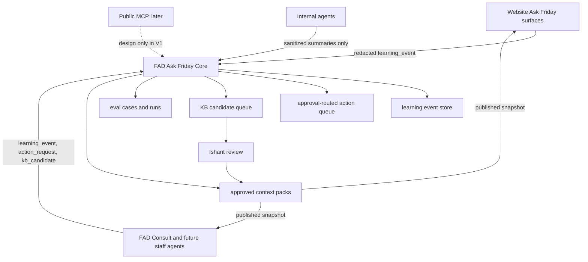

# Ask Friday Core V1 Architecture Recommendation

Date: 2026-05-23
Status: V1 backend contract scaffold, not deployed
Repo/session: FAD only. No Friday Website edits in this branch.

## Naming

The user-facing global AI surface is **Ask Friday**.

FridayOS can remain the broader product/system label where already canonical. The AI surface, Website FAB, guest assistant, owner chat, feedback assistant, and staff consult surface should use Ask Friday in product-facing language.

## Sources Read

- Notion: Ask Friday Unified AI Learning Loop - Scope 2026-05-23
- Notion: Friday System Atlas
- Notion: FAD Architecture & Integrations
- Notion: Friday Knowledge Base - Batch 1 Product AI Ops
- Notion: Ask Friday Product Register
- Filesystem: `/Users/judith/Friday Website/docs/ASK-FRIDAY-UNIFIED-AI-LEARNING-LOOP-2026-05-23.md`
- Filesystem: `/Users/judith/.codex/worktrees/fad-ask-friday-fab-polish-20260523/docs/handover/2026-05-23-fad-convergence-pending-tasks.md`

## Recommendation

FAD should own Ask Friday Core V1.

Reasoning:

- FAD is already the owner of public API auth, tenant scoping, Inbox/Consult, operations tasks, teachings, pending actions, learning-analyzer direction, and approved operational workflows.
- Website should remain a high-quality surface, not a second durable learning backend.
- Notion remains strategic/reference canon. FAD Postgres should own runtime events, review queues, snapshots, eval records, and approvals.
- Approved knowledge and behavior should flow down to surfaces as versioned context packs. Surface evidence should flow up as compact redacted events.

Core rule: no direct self-updating production truth. AI can observe, redact, summarize, cluster, propose, and generate eval candidates. Ishant approves anything that becomes canonical in V1.

## V1 Flow



## V1 Scope

- Add a FAD-owned surface registry.
- Add a FAD-owned published context pack store.
- Add a signed public route for compact redacted learning events.
- Add a KB candidate review queue contract.
- Add an approval-routed action request queue contract.
- Add identity/consent records for durable memory where authentication or explicit consent exists.
- Add eval-case/eval-run storage for production-derived regression tests.
- Keep public MCP as a schema/policy design target only until Website/FAD core loop is stable.

## Not V1

- Auto-publishing KB updates.
- Direct booking/payment/write-through from public MCP.
- Unlimited raw transcript retention.
- Anonymous durable memory without explicit consent.
- Public exposure of staff workload, staff identity, owner-private data, guest-sensitive data, payment data, or secrets.
- Fine-tuning.
- Full session replay.
- Broad frontend UI work in the current FAD FAB files.

## Contracts

### `surface_registry`

```json
{
  "surfaceId": "website_ask_friday_fab",
  "displayName": "Ask Friday FAB",
  "audience": "public_mixed",
  "sourceSystem": "friday-website",
  "accessClass": "public",
  "localePolicy": { "supported": ["en", "fr"], "match_user_locale": true },
  "allowedKnowledgeScopes": ["public_brand", "public_residences"],
  "allowedTools": ["route_intent", "search_residences", "check_availability"],
  "allowedActions": ["request_booking", "request_owner_followup", "request_handoff"],
  "memoryPolicy": { "anonymous": "session_only", "durable": "authenticated_or_explicit_consent" },
  "handoffPolicy": { "handoff_target": "fad_website_inbox", "human_takeover_stops_ai": true },
  "modelPolicy": { "primary": "website_default", "fallback": "website_fallback" },
  "contextBudget": { "baseline_tokens": 40000, "compact_after_messages": 32 },
  "evalSuiteIds": ["website_fab_routing", "handoff_correctness"],
  "status": "active"
}
```

Seeded surfaces:

- `website_guest_hero`
- `website_ask_friday_fab`
- `website_owner_enquiry`
- `website_feedback_bug`
- `website_feedback_feature`
- `fad_consult`
- `fad_ops_assistant`
- `fad_finance_assistant`
- `public_mcp` as planned
- `internal_agent_bridge`

### `learning_event`

```json
{
  "eventId": "afe_...",
  "createdAt": "2026-05-23T10:00:00+04:00",
  "sourceSystem": "friday-website",
  "surfaceId": "website_ask_friday_fab",
  "identityRef": {
    "identityType": "anonymous",
    "identityKey": "session-or-hash",
    "authenticated": false,
    "consentStatus": "unknown",
    "durableMemoryAllowed": false
  },
  "sessionId": "session-id",
  "locale": "en",
  "pageUrl": "https://friday.mu/en/residences",
  "intent": "find_property",
  "userTurnSummary": "Asked for a beachfront stay for 4 in July.",
  "assistantActionSummary": "Suggested residences and asked for dates.",
  "toolsUsed": ["search_residences", "check_availability"],
  "knowledgeUsed": ["public_residences", "guest_booking_rules"],
  "confidence": "medium",
  "outcome": "continued",
  "handoff": { "triggered": false, "reason": null },
  "signals": { "answerHelpfulness": null },
  "privacyClass": "medium",
  "redactionStatus": "redacted",
  "evidenceRefs": [
    {
      "evidenceType": "screenshot",
      "storageRef": "blob-or-object-ref",
      "privacyClass": "medium",
      "redactionStatus": "redacted",
      "summary": "Feedback screenshot, redacted."
    }
  ]
}
```

Website emitters must send summaries and references, not raw secrets, payment data, owner-private data, guest-sensitive data, or staff workload.

### `context_pack`

```json
{
  "packId": "website_ask_friday_fab_v3",
  "surfaceId": "website_ask_friday_fab",
  "version": 3,
  "status": "published",
  "knowledgeScopes": ["public_brand", "public_residences", "public_mauritius"],
  "behaviorRules": [{ "id": "low_confidence_handoff", "rule": "Escalate when confidence is low." }],
  "toolPolicy": { "web_search": "restricted_by_intent" },
  "memoryPolicy": { "anonymous": "session_only" },
  "sourceSnapshotRefs": [{ "type": "notion", "ref": "Ask Friday Product Register" }],
  "packPayload": { "compactPrompt": "Approved surface context." },
  "approvedBy": "Ishant"
}
```

Only `published` context packs are readable by public API clients.

### `kb_candidate`

```json
{
  "candidateId": "afc_...",
  "candidateType": "behavior_rule",
  "targetLayer": "surface_behavior",
  "proposedChange": {
    "operation": "add",
    "path": "website_feedback_bug.followup_policy",
    "value": "Inspect screenshot and diagnostics before asking follow-up questions."
  },
  "sourceEventIds": ["afe_..."],
  "evidenceSummary": "Repeated bug reports lacked screenshot analysis before questions.",
  "riskClass": "medium",
  "trustTier": "surface_evidence",
  "reviewStatus": "pending"
}
```

Review states: `pending`, `approved`, `rejected`, `expired`, `needs_info`.

### `action_request`

```json
{
  "actionId": "afa_...",
  "sourceSystem": "friday-website",
  "surfaceId": "website_ask_friday_fab",
  "requestedBy": { "identityType": "api_client", "identityKey": "friday-website" },
  "actionType": "request_booking",
  "riskClass": "approval",
  "payload": { "residence": "GBH-C8", "dates": "2026-07-10 to 2026-07-17" },
  "reason": "Guest asked to proceed.",
  "approvalRequired": true,
  "status": "pending"
}
```

V1 stores action requests only. Execution remains explicitly approval-routed.

### `identity_link`

```json
{
  "identityKey": "guest:stable-hash",
  "identityType": "stay_guest",
  "subjectRef": { "stayTokenHash": "stable-hash" },
  "durableMemoryAllowed": true,
  "consentStatus": "granted",
  "consentEventType": "memory_granted"
}
```

Durable cross-surface memory is allowed only for staff, authenticated owners, authenticated or stay-token guests, and explicit-consent public visitors. Anonymous visitors remain session-only.

## Runtime Storage

Migration `074_ask_friday_core.sql` adds:

- `ask_friday_surfaces`
- `ask_friday_context_packs`
- `ask_friday_learning_events`
- `ask_friday_evidence_refs`
- `ask_friday_kb_candidates`
- `ask_friday_action_requests`
- `ask_friday_eval_cases`
- `ask_friday_eval_runs`
- `ask_friday_identity_links`
- `ask_friday_consent_events`

## API Surface

Mounted at `/api/ask-friday/core`.

Public API client routes:

- `POST /events` with `ask-friday:events:write`
- `GET /context-packs/:surfaceId` with `ask-friday:context:read`
- `POST /action-requests/public` with `ask-friday:actions:write`
- `POST /identity-links/public` with `ask-friday:identity:write`

FAD staff routes:

- `GET /surfaces`
- `POST /surfaces`
- `POST /context-packs`
- `GET /kb-candidates`
- `POST /kb-candidates`
- `PATCH /kb-candidates/:candidateId`
- `GET /action-requests`
- `POST /action-requests`
- `PATCH /action-requests/:actionId`
- `POST /identity-links`
- `GET /eval-cases`
- `POST /eval-cases`

## Eval Plan

Start with lightweight JSON eval cases in FAD Postgres, then add runner/tooling.

Initial suites:

- `website_guest_grounding`: residence, availability, experience, and Mauritius facts are grounded.
- `website_fab_routing`: FAB routes guest, owner, feedback, and handoff intent correctly.
- `owner_scope`: owner chat avoids public web search and does not invent commitments.
- `handoff_correctness`: `human_takeover` or `aiMayReply:false` stops website AI replies.
- `feedback_repro_quality`: feedback assistant captures repro, expected/actual, evidence, suspected surface, acceptance criteria, and test ideas.
- `fad_consult_grounding`: staff consult uses conversation/property/reservation/teaching context correctly.
- `action_safety`: high-risk actions become approval requests, not direct execution.
- `privacy_redaction`: secrets, payment data, private guest/owner/staff data stay out of public KB and events.

Promotion gate:

1. Candidate created from event cluster or staff action.
2. Ishant approves candidate.
3. Published context pack version created.
4. Relevant eval suite runs.
5. Website/FAD consume the new published pack only after eval pass or explicit override.

## Privacy And Security Risks

- Memory poisoning from users claiming false policies, discounts, terms, or facts.
- Stale facts surviving in summaries or context packs.
- Public leakage of staff names, workload, private operations, owner data, or guest-sensitive data.
- Payment data and secrets entering event payloads.
- Cross-tenant leakage through global context loaders.
- Public MCP write/action abuse.
- Snapshot rollback gaps after a bad KB approval.
- Over-retention of raw traces/screenshots.
- Internal agent summaries accidentally mixing private engineering or credential details into public KB.

Mitigations in V1:

- Source trust tiers.
- Human approval before canon.
- Redaction at event normalization and emitter level.
- Tenant-scoped tables.
- Public routes gated by OAuth client-credentials JWT scopes.
- Separate approved context packs from raw learning events.
- Public MCP marked planned, not active.
- Evidence stored by reference and expiry metadata, not as unlimited raw content.

## Implementation Split

FAD backend/core session:

- Own migrations, contracts, public API routes, review queue routes, eval tables, identity/consent tables.
- Avoid active FAB UI files until the polish branch is merged or parked.
- Later: analyzer worker, review UI, eval runner, context-pack publisher.

Website session:

- Emit compact redacted `learning_event` payloads from guest hero, Ask Friday FAB, owner chat, and feedback FAB.
- Fetch published `context_pack` by surface before prompt/context construction.
- Do not create a Website-owned durable memory backend.
- Preserve `human_takeover` and `aiMayReply:false` behavior.

Public MCP session:

- Design schema/tool policy against the same registry and context-pack contracts.
- Do not implement direct public writes/payments/booking execution in V1.
- MCP can request actions, but action execution must remain approval-routed.

Internal agents session:

- Submit sanitized summaries, decisions, fixes, accepted runbooks, and eval candidates.
- Never ingest raw internal transcripts.

## Paste-Ready FAD Prompt

```plain text
Work on Ask Friday Core in FAD only.

Start from latest origin/fad-rebuild in a fresh worktree. Read:
- docs/architecture/ask-friday-core-v1-2026-05-23.md
- docs/handover/2026-05-23-ask-friday-core-v1.md
- Notion: Ask Friday Unified AI Learning Loop - Scope 2026-05-23
- Notion: FAD Architecture & Integrations

Goal:
Continue the FAD-owned Ask Friday Core backend. Build only safe backend/core slices: analyzer worker, KB candidate review APIs/UI, eval runner, and context-pack publisher. Do not touch the active Ask Friday FAB frontend files unless the polish branch has been merged or explicitly parked.

Guardrails:
- User-facing name is Ask Friday.
- No auto-publishing KB truth.
- Ishant approves canonical KB/behavior in V1.
- Public API writes create approval-routed action requests only.
- Preserve tenant scoping and public API JWT scope checks.
- Do not expose staff workload, owner-private, guest-sensitive, payment, or secret data.
```

## Paste-Ready Website Prompt

```plain text
Work on Friday Website Ask Friday event emission and context-pack consumption only.

Read:
- /Users/judith/Friday Website/docs/ASK-FRIDAY-UNIFIED-AI-LEARNING-LOOP-2026-05-23.md
- FAD doc: docs/architecture/ask-friday-core-v1-2026-05-23.md from branch codex/ask-friday-core-v1-20260523
- Website handoff docs for Ask Friday/FAD takeover behavior.

Goal:
Add compact redacted learning_event emitters for Website guest hero Ask Friday, Ask Friday FAB, owner enquiry chat, and feedback FAB. Add read-only consumption of published FAD context packs by surface. Do not build Website-owned durable memory.

Guardrails:
- User-facing name is Ask Friday.
- Preserve human_takeover and aiMayReply:false: after takeover, Website AI must stop replying.
- Visitor follow-ups after takeover go to FAD visitor-message proxy, not /api/ask-friday.
- Owner Ask Friday stays owner-scoped and no public web search unless separately approved.
- Emit summaries/evidence refs only. No raw secrets, payment data, owner-private data, guest-sensitive data, or private staff workload.
```

## Paste-Ready MCP Prompt

```plain text
Design public Ask Friday MCP V1 against the FAD Ask Friday Core contracts.

Read:
- docs/architecture/ask-friday-core-v1-2026-05-23.md
- /Users/judith/Friday Website/docs/MCP-WEBSITE-SCOPE-2026-05-22.md
- Notion: FAD Architecture & Integrations

Goal:
Produce a design-only MCP contract for safe public discovery and enquiry/request-to-book. Do not implement direct booking, payment, or irreversible write tools. MCP may query approved published context packs and may create approval-routed action requests.

Guardrails:
- Public MCP is planned, not active, until Website/FAD core loop is stable.
- No private FAD, staff, owner, guest, payment, or secret data in public MCP.
- All write-like behavior becomes action_request with approvalRequired=true.
```
