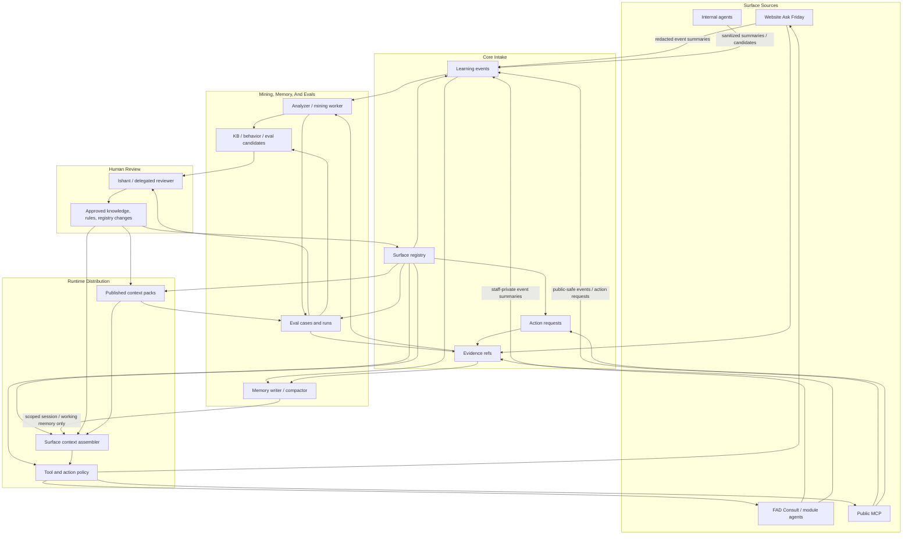

# Ask Friday Knowledge And Harness Catalog

Date: 2026-05-26
Status: planning/spec artifact on `codex/ask-friday-autonomous-core-20260526`
Scope: FAD + Website + Public MCP + internal-agent Ask Friday surfaces

## Naming And Ownership

- Ask Friday is the assistant and intelligence layer.
- FridayOS is the broader product/platform.
- FAD owns Ask Friday Core V1 runtime: surface registry, events, candidates, approvals, evals, context packs, identity/consent, and retention.
- Website, Public MCP, FAD modules, and internal agents are surfaces that consume approved packs and emit governed evidence/events.
- Friday Consult remains a staff-facing module-mode alias inside FAD. It is under Ask Friday; it is not a separate public assistant product or persona.
- GMS is legacy history only. It can be mined for patterns if accessible, but it is not a runtime dependency for new architecture.

## Current Implementation Truth

Current branch adds the first hardening layer on top of the deployed Core scaffold:

- Public Core policy enforces the surface registry, not only API scopes.
- Staff/private surfaces are blocked from public Core routes.
- Context-pack publishing validates requested scopes/tools against the target surface and now requires either a passing eval run or an explicit eval-gate override.
- Inbox/Friday Consult emits compact staff-private events to `fad_consult`.
- Ops Friday Consult emits compact staff-private events to `fad_ops_assistant`.
- Global FAD Ask Friday emits compact staff-private events to `fad_global_ask_friday`.
- Staff event emitters validate the surface registry before writing, including active status, source-system match, knowledge/tool policy, and redaction requirement for high/restricted events.
- Staff learning-event writes now populate dedicated evidence-ref rows when evidence refs are provided.
- Action-request review updates write lifecycle learning/evidence records.
- Global FAD Ask Friday mirrors non-navigation suggested and executed staff actions into Core action requests, so staff-click workflows become reviewable learning/audit signals.
- Staff-created Core action requests validate the surface registry before writing, matching the policy rail used by public action requests and the global FAD mirror.
- Inbox/Friday Consult now uses a database-visible lease around same-conversation turns.
- Analyzer/mining is worker-first. It does not start in the web process unless `ASK_FRIDAY_ANALYZER_IN_WEB=1`.
- Surface registry v0.2 seeds planned module profiles and records the active `ops-consult` runtime knowledge alias for `fad_ops_assistant`.
- Retention worker is available as a dry-run-by-default staff route and CLI. It deletes only expired evidence refs and old rejected/expired candidates when explicitly run with `dryRun:false`.
- Initial deterministic eval cases are seeded for public, staff, Ops, finance, MCP, and internal-agent safety suites.
- KB candidates carry review-lane metadata so public, staff ops, restricted finance/legal, owner-private, internal, and general candidates can be reviewed separately before canonical publishing.

The branch is pushed but not deployed. Production currently remains on the previously deployed `fad-rebuild` code until this branch is merged/deployed.

## Flow Closure

Every Core object must have a defined ingress, owner, egress, retention rule, and failure path. If a component has no downstream consumer or no safe failure path, it should not be in V1.

Flow rules:

- Evidence refs are inputs to audit, mining, review, and eval generation. They do not feed public prompts or canonical truth directly.
- Memory state has two write paths: short-lived/session compaction under surface policy, and durable semantic/procedural promotion through human review.
- Eval runs feed publish gates and review. Failed evals must block, require explicit override, or create/update a candidate.
- Registry changes are governed configuration changes. They can only flow back through human review or a staff-only admin path with explicit approval.
- Action requests create evidence and learning signals after approval, rejection, execution, or expiry.

## Knowledge Classes

| Class | Examples | Default access | Build now? |
|---|---|---|---|
| `public_brand` | Friday positioning, public service model, tone | public | yes |
| `public_residences` | public property descriptions, amenities, photos, public slugs | public | yes |
| `public_experiences` | public activity/experience descriptions | public | yes |
| `public_mauritius` | location guides, driving, weather caveats, travel basics | public | yes with freshness |
| `guest_booking_rules` | booking flow, enquiry, confirmation limits, handoff | public/guest | yes |
| `owner_public` | public owner/operator pitch, qualification | public/owner | yes |
| `guest_stay` | stay guide, arrival, access, issue handling | authenticated guest | later |
| `staff_inbox` | guest-message SOP, draft rules, takeover/handoff | staff | yes from current FAD |
| `ops_tasks` | task taxonomy, scheduling, turnovers, maintenance, supplies | staff ops | yes from current FAD/Ops |
| `properties_private` | property ops notes, access, owner-specific rules | staff/need-to-know | partial, controlled |
| `owner_private` | owner records, owner terms, statements, property-owner specifics | restricted | design only |
| `finance_restricted` | VAT/tax, owner payouts, workpapers, evidence | restricted | design only |
| `legal_restricted` | contracts, licences, compliance filings | restricted | design only |
| `hr_training` | SOPs, role guides, training progress | staff/manager | partial |
| `analytics_intelligence` | eval trends, aggregate KPIs, learning loop health | staff/Ishant | partial |
| `internal_engineering` | deploy facts, runbooks, architecture decisions | internal | internal only |

Every knowledge item needs:

- source and source owner,
- privacy class,
- trust tier,
- allowed surfaces,
- freshness/expiry rule,
- approval status,
- last reviewed date,
- evidence or source snapshot refs,
- eval suites that protect it.

## Harness Capability Tiers

| Capability | Public surfaces | Staff surfaces | Restricted surfaces |
|---|---|---|---|
| Answer from approved pack | yes | yes | yes |
| Ask clarifying question | yes | yes | yes |
| Use read/live tools | limited public tools | module tools | need-to-know tools |
| Draft message/task/document | request only or handoff | yes | yes, review-gated |
| Create action request | yes | yes | yes |
| Direct irreversible mutation | no | no by default | no by default |
| Learn from interaction | event only | event/candidate | restricted event/candidate |
| Publish canonical knowledge | no | no | no |
| Human approval required | for write-like effects | for high-risk effects | for almost all effects |

## Surface Profiles

### `website_guest_hero`

- Mission: help travelers choose residences, experiences, and Mauritius stay plans.
- Knowledge: `public_brand`, `public_residences`, `public_experiences`, `public_mauritius`, `guest_booking_rules`.
- Tools: residence search, availability, lowest-rate/quote read, experiences, places.
- Actions: request booking, request handoff, emit event.
- Memory: anonymous session-only; authenticated/stay-token scoped later.
- Eval gates: no invented price/availability, grounded residence facts, language match, no booking confirmation without action result, takeover stop behavior.
- Research to build now: STR booking support, hospitality escalation, Mauritius public travel/accommodation facts.
- Needs Ishant review: exact public booking/owner handoff wording and any commercial commitments.

### `website_ask_friday_fab`

- Mission: universal public router for guest, owner, feedback, support, and general Friday/Mauritius intent.
- Knowledge: guest public pack, owner public overview, feedback routing, current page context.
- Tools: intent router, public catalog tools, availability, places, diagnostics if feedback.
- Actions: request booking, owner follow-up, feedback issue, handoff.
- Memory: anonymous session-only; durable only with auth or explicit consent.
- Eval gates: intent routing, privacy redaction, owner/guest separation, feedback routing, handoff behavior.
- Needs Ishant review: durable personalization language and consent UX.

### `website_owner_enquiry`

- Mission: convert owner/operator leads without inventing commercial or legal commitments.
- Knowledge: `owner_public`, service model, owner qualification, public FridayOS overview.
- Tools: owner-field extraction, follow-up prep, handoff.
- Actions: request owner follow-up, emit event.
- Memory: session-only until explicit consent/authenticated owner context.
- Eval gates: no invented fee/legal guarantee, no public web search by default, correct qualification.
- Research to build now: owner reporting best practices, vacation-rental management service expectations.
- Needs Ishant review: exact management package claims, fee language, approval commitments.

### `website_feedback_bug` and `website_feedback_feature`

- Mission: turn reports/suggestions into product-ready capsules.
- Knowledge: feedback diagnostics, public site context, privacy rules.
- Tools: inspect page/deploy/context metadata; future screenshot analysis after redaction policy.
- Actions: create feedback issue/candidate, emit event.
- Memory: session-only; bounded evidence retention.
- Eval gates: repro quality, expected/actual, screenshot/evidence summary, no sensitive leakage, no roadmap overpromise.
- Needs Ishant review: screenshot retention window and whether feedback can become direct product candidates.

### `fad_global_ask_friday`

- Mission: FAD-wide staff command surface for cross-module questions, navigation, safe task/team-message proposals, and approval requests.
- Current source: `POST /api/friday/ask` in `backend/src/fad/friday.js`.
- Current harness: server builds live module context, accepts client-provided recent history, returns structured action buttons, and only executes actions after staff clicks `/api/friday/actions/execute`.
- Knowledge: live module read models, requested module summaries, context source status, module-specific data truth.
- Tools/actions: navigate, create task, send team message, request approval through the MCP action gateway after staff click.
- Memory: client-provided recent history only today; no durable server session.
- Eval gates: no fixture/demo truth, no direct action execution in answer path, safe action policy, correct source-status caveats, no cross-module private leakage beyond staff authorization.
- Build now: add Core event emission and later align safe writes with Core action-request ledger.
- Needs Ishant review: whether staff-click "safe" actions should also mirror into `ask_friday_action_requests` for one audit lane.

### `guest_portal_ask_friday`

- Mission: authenticated/stay-token guest support inside stay/guest portal.
- Core route note: this is not public-readable through the current public context-pack policy. It needs a separate authenticated guest route/policy before runtime consumption.
- Knowledge: property guide, stay-specific rules, public Mauritius, support rules.
- Tools: load stay context, property guide, request team help.
- Actions: guest support request, handoff.
- Memory: stay-token scoped; durable only under consent/terms.
- Eval gates: no other-guest leakage, no staff workload leakage, correct stay context.
- Needs Ishant review: whether authenticated personalization is implicit under stay terms or requires explicit opt-in.

### `fad_consult`

- Mission: staff assistant for guest messages, drafts, teachings, pending actions, and operational decisions.
- Current sources: conversations/messages, website inbox events after handoff, reservation/property context, teachings, action feedback, runtime knowledge composer.
- Current harness: durable `consult_sessions`, history, summary generation, stale-draft guards, full-to-compact fallback, same-conversation DB lease.
- Actions: draft reply, teaching action, task suggestion, candidate/action request later.
- Memory: durable team-visible where authorized; raw transcript remains evidence, not canonical memory.
- Eval gates: latest guest turn, property/reservation grounding, draft-only send behavior, stale draft prevention, teaching/candidate quality.
- Build now: mining/eval cases from recent FAD Consult events after this branch starts collecting events.
- Needs Ishant review: staff session visibility matrix and retention windows.

### `fad_ops_assistant`

- Mission: help Ops staff close tasks and help managers plan work.
- Current sources: `ops-consult` KB, visible tasks, schedule, roster, reservations, staff list, current plan/draft, property metadata preview.
- Current harness: JSON module context, action tags parsed into reversible suggestions, draft/apply/clear/undo protocol in UI, learning events to `fad_ops_assistant`.
- Actions: draft schedule, apply schedule draft, clear times, undo, create task draft, request owner approval.
- Memory: team-visible ops context; staff workload stays internal.
- Eval gates: source-of-truth correctness, task safety, owner approval thresholds, no external mutation without explicit staff action, no public staff workload leakage.
- Build now: Ops profile/eval cases and mapping policy from runtime key `ops-consult` to registry surface `fad_ops_assistant`.
- Needs Ishant review: exact owner/staff exceptions, vendor pricing assumptions, maintenance charge rules.

### `fad_reservations_calendar_assistant`

- Mission: support reservation lookup, availability, quotes, overlaps, inquiry follow-up, and booking proof.
- Knowledge: reservations as primary key, Guesty calendar cache, quotes, availability search, guest inquiry follow-up SOP.
- Tools: load reservation, load calendar, availability search, draft quote.
- Actions: create quote draft, follow-up candidate, handoff/action request.
- Memory: staff scoped; guest personal detail only where operationally required.
- Eval gates: no invented availability, live data caveats, quote grounded in current cache, correct null-status/inquiry behavior.
- Build now: profile and eval cases; avoid UI/front-end calendar overlap unless coordinated.
- Needs Ishant review: Friday Website URL quote shape before real external sends.

### `fad_properties_assistant`

- Mission: maintain and retrieve property truth.
- Knowledge: property cards, amenities, access, public/private split, ops notes, owner rules, property size/cleaning classifications.
- Tools: load property, reservations for property, tasks/issues for property.
- Actions: property KB candidate, property update request.
- Memory: property-scoped; public facts separate from staff-only notes.
- Eval gates: public/private split, freshness, no private owner/staff leakage.
- Build now: property knowledge split spec using existing Guesty/Breezeway/FAD source roles.
- Needs Ishant review: property-specific owner exceptions and access-note privacy.

### `fad_finance_assistant`

- Mission: support finance operations, owner statements, classifications, VAT/tax, and workpapers.
- Knowledge: finance workflows, owner statement rules, tax/VAT policy, chart of accounts, evidence requirements.
- Tools: load finance summary, owner-statement context, draft workpaper.
- Actions: finance candidate, approval request.
- Memory: need-to-know; no public cross-surface sharing.
- Eval gates: no invented numbers, no cross-owner leakage, finance privacy, human approval for external output.
- Build now: design-only catalog and eval cases.
- Needs Ishant review: full finance access/redaction matrix and source-of-truth rules.

### `fad_legal_admin_assistant`

- Mission: support contracts, compliance, filings, licences, and controlled document generation.
- Knowledge: legal/admin policy, contracts, compliance calendar, license register, document templates.
- Tools: load contract context, load compliance item, draft document request.
- Actions: legal candidate, approval request.
- Memory: need-to-know.
- Eval gates: no legal hallucination, no external commitment without review, source/date caveats.
- Build now: design-only controlled knowledge map.
- Needs Ishant review: which legal/admin documents can be summarized by AI and which cannot.

### `fad_hr_training_assistant`

- Mission: support SOP recall, onboarding, training, role-specific guidance, and quality expectations.
- Knowledge: SOPs, role guides, training progress, quality rules.
- Tools: load SOP, load training progress, draft training task.
- Actions: training task candidate, SOP candidate.
- Memory: staff scoped; private HR/performance notes restricted.
- Eval gates: role-appropriate guidance, no sensitive HR disclosure, no disciplinary hallucination.
- Build now: SOP/profile catalog and eval cases.
- Needs Ishant review: HR privacy boundaries and who can see training/performance memory.

### `fad_owners_assistant`

- Mission: support owner communication, owner records, owner statements, and owner-facing draft actions.
- Knowledge: owner records, owner terms, statement rules, property-owner context.
- Tools: load owner, load owner properties, load owner statement context.
- Actions: draft owner reply, owner action request, owner KB candidate.
- Memory: owner-scoped and need-to-know.
- Eval gates: owner isolation, no cross-owner leakage, no financial hallucination.
- Build now: design only until owner-private and finance boundaries are locked.
- Needs Ishant review: owner-facing authenticated surface timing and exact claims/approval paths.

### `fad_analytics_intelligence`

- Mission: help Ishant/team understand product, ops, eval, and learning-loop patterns.
- Knowledge: aggregate metrics, eval results, learning-event trends, module metrics.
- Tools: query aggregate metrics, eval runs, learning candidates.
- Actions: report candidate, eval candidate.
- Memory: aggregate preferred; raw PII excluded by default.
- Eval gates: correct aggregation, source/date caveats, no PII leakage.
- Build now: learning-loop dashboards/report specs after event volume exists.
- Needs Ishant review: which metrics can be visible to managers versus Ishant-only.

### `public_mcp`

- Mission: let external AI clients discover public Friday data and submit safe requests.
- Knowledge: published public context packs only.
- Tools: public truth query, search residences, lowest-rate/read, check availability, list experiences.
- Actions: request booking, send enquiry, owner enquiry, all mapped to `action_request` or existing safe request endpoints.
- Memory: durable disabled in V1.
- Eval gates: public truth grounding, no private data, no direct booking/payment, scoped OAuth/tool annotations.
- Build now: design contract only.
- Needs Ishant review: public MCP domain/security launch timing.

### `internal_agent_bridge`

- Mission: let Codex, Claude, Judith, and future internal agents submit sanitized work summaries, decisions, runbooks, and eval candidates.
- Knowledge: approved architecture, runbooks, engineering decisions.
- Tools: submit sanitized summary, query approved truth.
- Actions: KB candidate, eval candidate.
- Memory: raw transcripts not ingested; summaries require review.
- Eval gates: no credentials, no private cockpit memory, source provenance, no automatic canon.
- Build now: schema/prompt design only.
- Needs Ishant review: whether accepted implementation summaries can auto-create low-risk candidates or always require manual review.

## Session And Memory Policy

| User/context | Default | Shared visibility | Durable memory |
|---|---|---|---|
| Anonymous website visitor | session only | visitor only; summary after handoff/event | no |
| Authenticated/stay-token guest | stay scoped | guest + authorized staff | only with consent/terms |
| Owner public lead | session only | lead handoff summary | only with consent/auth |
| FAD global staff Ask Friday | client-provided recent history today | staff user only today | planned server-side session |
| Authenticated owner | owner scoped | owner + authorized staff | yes, scoped |
| FAD staff Consult | session/history stored | authorized staff in same conversation/module | yes, staff-private |
| Ops staff/manager | module/task scoped | ops-authorized staff | yes, staff-private |
| Finance/legal | restricted need-to-know | restricted roles | yes, restricted |
| Internal agents | sanitized summary only | reviewer/Core | no raw transcript memory |

Memory types:

- working state: active turn/task, always short-lived,
- session summary: compact continuity state, not canonical,
- episodic trace: evidence of what happened, used for audit/mining/evals,
- semantic fact: approved fact, canonical,
- procedural rule: approved behavior, canonical,
- candidate memory: proposed learning awaiting review.

## Knowledge Build Plan

### Can build now from public/current sources

- Public brand/residence/experience/Mauritius packs.
- Guest booking and handoff rules from Website/FAD docs.
- Owner-public objection/qualification skeleton.
- Ops turnover, maintenance, scheduling, supplies, owner-approval rules already started in `docs/operations/2026-05-26-ops-friday-consult-kb.md`.
- Inbox/Friday Consult behavior from current FAD implementation.
- Reservation/calendar eval cases from the active calendar/quote/booking-proof behavior.
- Property public/private split spec.
- Public MCP safety/tool schemas.
- Internal-agent bridge summary/candidate prompts.

### Keep design-only until reviewed

- Finance and owner statement exact logic.
- Legal/admin compliance advice and document summaries.
- Owner-private property terms.
- Guest-sensitive stay memory and cross-surface personalization.
- Staff performance/HR memory.
- Direct action execution beyond draft/request/approval queues.

## Research Signals Folded In

AI/agent architecture:

- Anthropic agent guidance supports simple, composable workflows before complex multi-agent systems, and strong tool descriptions/harnesses.
- OpenAI eval guidance supports trace/tool-path grading, not only final-answer checks.
- LangGraph and Google ADK memory docs support typed memory: session/working state versus long-term memory.
- MCP authorization guidance supports scoped OAuth and server-side authorization, not prompt-only security.
- OWASP LLM Top 10 supports treating prompt injection, data leakage, excessive agency, and insecure outputs as first-class design risks.
- Community signal from AI agent builders is consistent: memory, evals, observability, retries, state persistence, human review, and narrow scopes matter more than large prompts.

Hospitality/STR operations:

- STR turnover guidance consistently emphasizes room-by-room checklists, restocking, maintenance/safety checks, photo evidence, and inspection.
- Field-service scheduling guidance emphasizes skill match, zone/travel-time routing, job duration models, standby work, and schedule disruption handling.
- Owner-reporting guidance emphasizes transparent monthly statements, reservation/expense line detail, reconciled payouts, and audit trails.
- Mauritius official sources confirm the Tourist Fee regime and Tourist Accommodation Certificate categories; any legal/tax answer must remain source-dated and reviewed before public use.

Useful source URLs are tracked in `docs/architecture/ask-friday-agent-research-notes-2026-05-26.md` plus the source list below.

## Source List For This Catalog

- https://www.anthropic.com/engineering/building-effective-agents
- https://www.anthropic.com/engineering/writing-tools-for-agents
- https://www.anthropic.com/engineering/effective-harnesses-for-long-running-agents
- https://platform.openai.com/docs/guides/agent-evals
- https://platform.openai.com/docs/guides/trace-grading
- https://docs.langchain.com/oss/javascript/langgraph/memory
- https://google.github.io/adk-docs/sessions/memory/
- https://google.github.io/adk-docs/evaluate/
- https://modelcontextprotocol.io/specification/2025-06-18/basic/authorization
- https://owasp.org/www-project-top-10-for-large-language-model-applications/
- https://www.mra.mu/eservices1/individual/11-e-services
- https://www.tourismauthority.mu/tourist-accommodation-certificate/
- https://www.hostaway.com/glossary/owner-statements/
- https://www.rental-network.com/resource/vacation-rental-trust-accounting
- https://resources.tellusapp.com/passive-income/short-term-rentals/cleaning-and-turnover-guide
- https://www.leasense.com/resources/checklists/short-term-rental-checklist-turnover
- https://softabase.com/guides/field-service-scheduling-optimization-guide
- https://www.fieldservicely.com/blog/how-to-optimize-field-service-scheduling

Community/anecdotal sources checked:

- Reddit AI agent memory/evals/production discussions from 2026.
- Reddit STR/ShortTermRentals discussions on turnover checklists, restocking, owner reporting, and tool stacks.
- Reddit Mauritius discussions on tourist accommodation licensing/tourist tax confusion.

Community sources are useful signals only. They cannot become canonical Friday policy without review and source corroboration.

## Open Review Queue For Ishant

Proceeding assumptions, to be reviewed later:

1. FAD staff Consult history should be visible to authorized staff in the same conversation/module, not globally.
2. Authenticated/stay-token guest personalization is useful, but explicit consent or terms language must be confirmed before durable cross-surface use.
3. Ishant is sole V1 canonical approver; delegated reviewers can be added later by domain.
4. Ops is the first module profile after Inbox/Consult because it is active and already has real KB work.
5. Finance/legal/owner-private modules remain design-only until access/redaction/source-of-truth rules are locked.
6. Public MCP can expose read/discovery and request actions only. Direct payment, direct booking, staff workload, owner-private reads, and finance/legal reads are out of V1.
7. Old GMS can be mined only as low/medium-trust legacy pattern evidence, never as current truth.

## Next Safe Implementation Order

1. Merge/deploy current hardening branch only after PM2/process plan for analyzer worker is accepted.
2. Add formal registry/profile rows or aliases for active FAD module surfaces, especially `ops-consult` -> `fad_ops_assistant`.
   - Status: covered by migration `096_ask_friday_surface_registry_v02.sql` in this branch.
3. Add eval cases for public policy blocks, staff event emission, Consult locks, Ops action safety, and context-pack publish gates.
   - Status: publish gate now requires a passing eval run or explicit override; initial deterministic eval cases are seeded in migration `097_ask_friday_seed_eval_cases.sql`.
4. Add retention/redaction worker for events/evidence/candidates.
   - Status: dry-run-by-default retention route/CLI exists in this branch for expired evidence refs and old rejected/expired candidates only.
5. Add Core learning-event emission for global FAD staff Ask Friday.
   - Status: covered in this branch.
6. Add review-lane metadata so Ishant can separate public, staff, restricted, and internal candidates.
   - Status: covered by migration `098_ask_friday_candidate_review_lanes.sql`; analyzer-created candidates now set lane/domain/surface/privacy metadata.
7. Coordinate a Website branch for event emission and context-pack consumption.
8. After Website and FAD loops are stable, design/implement Public MCP V1.
9. Only then expand into finance/legal/owner-private module KB ingestion.
