# Ask Friday Master Plan v0.2

Date: 2026-05-26
Status: execution-grade master plan expansion
Current continuation branch: `codex/ask-friday-continuation-20260528`
Historical PR: `https://github.com/Friday-mu/friday-mu/pull/9` merged as `da67c7be`; production later advanced to `7caf6576`
Notion mirror: `https://www.notion.so/36c43ca88492815d9644e44b14a297d0`

## Purpose

This document develops the broad Ask Friday Intelligence Master Plan into an execution-grade anchor.

The master plan remains the north-star document for Ask Friday Core and all Ask Friday surfaces inside FridayOS. This v0.2 expansion adds the missing structure needed to execute without confusing "planned" with "built":

- planning doctrine;
- phase map;
- subplan template;
- first-wave execution tree;
- surface readiness criteria;
- decision log / ADR rules;
- research and KB factory rules;
- review and update cadence.

Use this with:

- `docs/architecture/ask-friday-core-manifest-2026-05-26.md`
- `docs/architecture/ask-friday-completion-ledger-2026-05-26.md`
- `docs/architecture/ask-friday-surface-subplans-2026-05-26.md`
- `docs/architecture/ask-friday-kb-research-factory-2026-05-26.md`
- `docs/architecture/ask-friday-eval-mining-adr-plan-2026-05-26.md`
- `docs/architecture/ask-friday-knowledge-harness-catalog-2026-05-26.md`
- `/Users/judith/.openclaw/workspace/tmp/ask-friday-intelligence-master-plan-2026-05-26.md`

## Research Basis

This plan uses current agent and architecture planning guidance from:

- OpenAI practical agent guidance: start with a clear workflow, well-defined tools, structured instructions, layered guardrails, and human intervention for high-risk actions.
- Anthropic effective agents guidance: prefer simple composable workflows before complex autonomous agents; use agents when the problem truly needs dynamic planning/tool use.
- Anthropic context/harness guidance: the folder/file structure, tool interfaces, context layout, and harness become part of agent behavior.
- Anthropic and Google ADK eval guidance: evaluate both final answers and the trajectory/tool-use path.
- OpenAI tracing guidance: record tool calls, handoffs, guardrails, generations, and custom events as inspectable traces.
- MCP authorization guidance: keep authorization, resource ownership, and upstream tokens explicit.
- OWASP LLM and agentic-skill guidance: prompt injection, excessive agency, tool misuse, identity/privilege, and sensitive-data leakage are architecture risks, not prompt-only problems.
- ADR/RFC practice: keep important decisions short, versioned, and source-controlled with context and consequences.
- Diataxis documentation structure: separate explanation, how-to, reference, and tutorial/recovery material instead of putting every detail in one page.
- Current builder/community signal: successful long-running agent work tends to use compact indexes, layered memory, explicit namespaces, and lazy-loaded topic files instead of giant always-loaded context.

## Planning Doctrine

### 1. The Master Plan Is The Anchor, Not The Dumping Ground

The master plan should answer:

- what Ask Friday is;
- where Ask Friday Core lives;
- what surfaces exist;
- how knowledge, memory, tools, actions, evals, and learning flow;
- what order we execute in;
- where subplans live.

It should not contain every KB detail, every prompt, every eval case, every source excerpt, or every implementation diff. Those belong in subplans and reference docs.

### 2. Use One Plan Tree, Four Document Types

Ask Friday planning should use four document classes:

| Document type | Role | Example |
|---|---|---|
| Anchor | Explains the architecture and phases | this master plan |
| Subplan | Makes one surface/track executable | Ops subplan, Website guest subplan |
| Reference | Defines contracts, schemas, KB inventories | contracts, surface registry, KB catalog |
| Ledger | States what is actually built/tested/live | completion ledger |

This prevents a broad plan from being mistaken for runtime truth.

### 3. Every Phase Needs Exit Criteria

A phase is not done because a document exists. It is done only when its exit criteria are met.

Minimum exit criteria:

- owner clear;
- inputs clear;
- outputs clear;
- dependencies clear;
- acceptance tests/evals clear;
- privacy class clear;
- rollback/failure path clear;
- status updated in the completion ledger.

### 4. Use ADRs For Decisions That Will Be Re-Litigated

Create a short ADR when we make a durable choice about:

- FAD vs Website ownership;
- memory visibility;
- context-pack publishing rules;
- public MCP action scope;
- analyzer worker deployment;
- Finance/legal/owner privacy boundaries;
- agent naming/surface taxonomy;
- direct mutation vs approval request.

ADR template:

```md
# ADR: <decision>

Date:
Status: proposed | accepted | superseded
Owner:

## Context
## Decision
## Alternatives Considered
## Consequences
## Review Trigger
```

### 5. Start From Workflows, Not Agent Count

Do not start by asking "how many agents do we need?"

Start with:

- what user workflow needs help;
- what state the workflow needs;
- what tools/actions are safe;
- what the assistant must never do;
- how success is measured;
- what happens when it is uncertain.

Only split into module agents when separate knowledge, access, tools, or failure modes justify it.

### 6. Harness Before UI

For Ask Friday, the important design surface is the harness:

- context assembler;
- tool policy;
- action policy;
- memory/session rules;
- eval gate;
- human review queue;
- evidence retention;
- handoff/takeover behavior.

The UI should expose the harness. It should not define it.

### 7. Typed Memory Or No Durable Memory

Memory must be typed before it is durable:

| Memory type | Use | Canonical? |
|---|---|---|
| Working state | active task/turn | no |
| Session summary | continuity inside a conversation/session | no |
| Episodic evidence | audit, trace, mining, evals | no |
| Candidate memory | proposed learning | no |
| Semantic fact | approved Friday truth | yes |
| Procedural rule | approved behavior/harness rule | yes |

Raw transcripts are evidence, not runtime memory. Durable semantic/procedural memory needs review approval.

### 8. Evidence Must Flow Somewhere

Every event, trace, eval, and candidate must have:

- ingress;
- owner/processor;
- egress;
- retention rule;
- failure path.

If a box has no downstream consumer or no safe failure path, it is not V1 architecture.

### 9. Evals Must Test Trajectory, Not Only Final Text

For each surface, define evals across:

- final answer quality;
- tool-use trajectory;
- source grounding;
- privacy and leakage;
- action/request safety;
- handoff behavior;
- refusal/uncertainty behavior;
- regression cases from real failures.

For Ops and Inbox, trajectory evals matter more than general answer style.

### 10. Server-Side Policy Beats Prompt Policy

Prompts can express intent. They are not security boundaries.

Tool/action access must be enforced by:

- route auth;
- surface registry;
- allowed knowledge scopes;
- allowed tool/action lists;
- risk class;
- approval requirements;
- audit/evidence logs.

### 11. Human Review Is The Canonical Learning Gate

Learning events and mining outputs can create candidates. They cannot create canonical truth.

V1 rule:

- candidate -> review -> approved context/KB/rule -> eval gate -> published context pack.

No direct self-updating production truth.

### 12. Keep Public, Owner, Guest, Staff, Finance, And Legal Contexts Separate

Do not load global competitor, legal, owner, guest-sensitive, or staff workload context into every surface.

Scope context by surface:

- public guest surfaces: public brand, residences, experiences, stay help, Mauritius context;
- owner/sales surfaces: owner packages, positioning, commercial claims, qualification;
- Ops surfaces: tasks, staff, schedules, reservations, property ops, vendors;
- Inbox surfaces: thread, reservation, property, teachings, reply policy;
- finance/legal/HR: restricted context only;
- public MCP: public approved context only.

## Master Execution Tree

```mermaid
flowchart TD
  A["Ask Friday Master Plan"] --> B["Plan 1: Inbox + Ops production readiness"]
  A --> C["Plan 2: Core learning loop and review operations"]
  A --> D["Plan 3: Surface and KB buildout"]
  A --> E["Plan 4: Website and public surfaces"]
  A --> F["Plan 5: MCP and internal agent bridge"]
  A --> G["Plan 6: Operating cadence and continuous improvement"]

  B --> B1["live Inbox/Ops smoke and team-usefulness proof"]
  B --> B2["Inbox preserve mature harness"]
  B --> B3["Ops formalize schedule/roster harness"]

  C --> C1["events and evidence"]
  C --> C2["candidate lanes"]
  C --> C3["eval gates"]
  C --> C4["analyzer/mining worker"]

  D --> D1["surface subplans"]
  D --> D2["KB source matrices"]
  D --> D3["harness contracts"]
  D --> D4["acceptance evals"]

  E --> E1["Website emitters"]
  E --> E2["published context pack consumption"]
  E --> E3["handoff preservation"]

  F --> F1["public MCP read/request only"]
  F --> F2["internal sanitized summary bridge"]

  G --> G1["weekly mining"]
  G --> G2["monthly freshness review"]
  G --> G3["ADR and ledger maintenance"]
```



## Plan 1: Inbox And Ops Production Readiness

Goal: make the active staff surfaces useful in production before expanding the architecture.

Status:

- PR #9 was merged on 2026-05-27 as `da67c7be`.
- Ask Friday Core hardening, Inbox event wrapping, Ops event wrapping, DB consult locks, eval seeds, candidate lanes, and Ops scheduling constraints are now on `fad-rebuild`.
- Production frontend and backend reported deployed SHA `7caf6576` during the 2026-05-28 recovery pass.
- Plan 1 is deployed and non-destructive API/model smoke passed on 2026-05-28, but it is not yet marked fully team-useful until real Inbox and Ops browser/workflow QA passes.

Scope:

- FAD only.
- Inbox/Friday Consult and Ops/Friday Consult.
- No Website code in this slice.
- No public MCP.

Execution sequence:

1. Smoke:
   - version endpoints;
   - Core surfaces;
   - private/public route policy;
   - Inbox draft/consult unchanged from user perspective;
   - Ops schedule/roster useful for Franny;
   - global FAD Ask Friday harmless action path.
2. Run real browser/workflow QA for Inbox and Ops staff scenarios.
3. Patch only blockers.
4. Update completion ledger and Notion.

Exit criteria:

- Inbox remains user-facing stable.
- Ops can create useful daily/weekly/monthly schedule and roster drafts.
- Occupied properties are respected except urgent guest-linked exceptions.
- All tasks in generated plan are assigned or the draft is blocked/explains why not.
- Lunch/coverage rules are reflected.
- Staff-private context does not leak to public routes.
- Team-useful status is confirmed by live smoke.

## Plan 2: Core Learning Loop And Review Operations

Goal: make Ask Friday Core more than storage tables by closing the loop from event to candidate to eval to published context pack.

Subplans:

1. Event and evidence lifecycle
   - define event trust tiers;
   - ensure evidence refs are bounded and classified;
   - define retention per privacy class.
2. Candidate review lanes
   - public-safe;
   - staff ops;
   - owner-private;
   - finance/legal restricted;
   - internal/general.
3. Eval gates
   - deterministic policy evals;
   - trajectory/tool evals;
   - response quality evals;
   - privacy/safety evals.
4. Analyzer/mining worker
   - off live request path;
   - schedule explicit;
   - never publishes canonical truth directly.
5. Context-pack publisher
   - requires approved candidate or manual override;
   - requires passing eval or explicit eval override;
   - records publish evidence.

Exit criteria:

- A candidate cannot become production context without approval.
- Failed evals block publish or create reviewable candidates.
- Analyzer/mining jobs can run without slowing live chat.
- Reviewers can see why a candidate exists and where it came from.

## Plan 3: Surface And KB Buildout

Goal: turn broad module ideas into executable surface profiles and KB plans.

Do one surface at a time. Each surface needs the standard subplan template below.

Initial order:

1. Reservations/calendar.
2. Properties.
3. Website guest hero/FAB.
4. Owner enquiry.
5. Feedback.
6. Guest portal.
7. HR/training.
8. Analytics/intelligence.
9. Finance.
10. Legal/admin.
11. Public MCP.
12. Internal agent bridge.

Reasoning:

- Reservations/calendar and properties are upstream dependencies for Ops, Inbox, guest help, and owner work.
- Website surfaces become safer after public/private property and reservation facts are clean.
- Finance/legal stay later because privacy/access and source-reviewed compliance matter more than speed.

Current Plan 3 packet:

- `docs/architecture/ask-friday-reservations-properties-source-matrix-2026-05-28.md`
  - Reservations/Calendar and Properties are now source-mapped against current FAD runtime paths and Guesty docs.
  - This packet is planning/research proof only. It does not mean either surface is built as a dedicated agent.
  - It defines first tool contracts to design later: reservation context, calendar context, property context, and approval-routed reservation actions.
- `docs/architecture/ask-friday-reservation-property-tool-contracts-2026-05-28.md`
  - Design-only contract draft for those first tools. Use it before implementation or eval seeding.
- `docs/architecture/ask-friday-website-owner-feedback-source-matrix-2026-05-28.md`
  - Website public Ask Friday, owner enquiry/FAD owners assistant, and feedback/bug-learning are now source-mapped.
  - This packet is planning/research proof only. It does not mean Website, owner, or feedback surfaces are wired to Core runtime.
  - It defines eval seeds and open Ishant-review decisions before public/owner KB/context-pack publishing.
- `backend/migrations/102_ask_friday_public_owner_feedback_evals.sql`
  - Branch-only deterministic eval scaffolding for those scoped risks. It is not deployed.

Exit criteria for each surface:

- surface profile complete;
- source-of-truth matrix complete;
- KB gaps listed;
- privacy class clear;
- harness plan complete;
- first eval suite drafted;
- first implementation slice defined;
- ledger updated as `scoped`, not `built`.

## Plan 4: Website And Public Surfaces

Goal: connect public Website Ask Friday surfaces to Ask Friday Core without breaking takeover/handoff.

Scope:

- Website guest hero Ask Friday.
- Website Ask Friday FAB.
- Owner enquiry chat.
- Feedback FAB/chat.
- Later guest portal Ask Friday.

Rules:

- Website emits compact redacted events.
- Website consumes only published context packs.
- Website does not read staff-private FAD knowledge.
- `human_takeover` or `aiMayReply:false` remains authoritative.
- Visitor follow-ups after takeover go to the FAD visitor-message proxy.
- Owner Ask Friday remains owner-scoped and no public web search unless separately approved.

Exit criteria:

- public event schema works;
- redaction tested;
- handoff/takeover regression tested;
- public context-pack consumption tested;
- no staff/private leakage.

## Plan 5: Public MCP And Internal Agent Bridge

Goal: expose useful external/internal integration without granting unsafe write access.

Public MCP V1:

- public read/discovery tools only;
- write-like operations create approval-routed action requests;
- no direct booking;
- no direct payment;
- no direct ops mutation;
- no private owner/staff/guest data.

Internal agent bridge V1:

- agents submit sanitized summaries/candidates;
- no raw transcript ingestion by default;
- all candidates carry source, repo/session, privacy class, and evidence summary;
- no direct canonical write.

Exit criteria:

- MCP auth/scopes clear;
- tool/action policy enforced server-side;
- request/action audit visible;
- internal candidate format reviewed.

## Plan 6: Operating Cadence

Goal: keep Ask Friday improving without uncontrolled drift.

Cadence:

- Daily:
  - error/low-confidence/event anomaly review if volume exists.
- Weekly:
  - mine recent FAD Inbox and Ops conversations;
  - review candidate clusters with Ishant;
  - add/adjust eval cases from real misses.
- Monthly:
  - refresh public/owner/pricing/legal/local-context KBs;
  - review retention and privacy exceptions;
  - retire stale context packs;
  - update the master plan if phase ordering changes.
- After every deploy:
  - update completion ledger;
  - update manifest if files/URLs/branches changed;
  - record new ADRs for durable decisions.

## Standard Surface Subplan Template

Every surface subplan must include:

```md
# Ask Friday Surface Subplan: <surface>

Status:
Owner:
Target users:
Current runtime state:
Planned implementation phase:

## Mission
What workflow this surface exists to improve.

## Non-Goals
What this surface must not do in V1.

## Source Truth
Tables, APIs, docs, Notion pages, staff owners, external sources.

## Knowledge Scopes
Public, guest, owner, staff, finance/legal, local, competitor, industry.

## Privacy And Access
Audience, identity type, consent, private fields, redaction rules.

## Harness
Context assembly, tools, actions, session memory, compaction, handoff.

## Learning Loop
Events emitted, evidence refs, mining signals, candidate types.

## Evals
Final-answer, trajectory/tool, grounding, privacy, action safety.

## Acceptance Criteria
How we know this is team-useful or production-ready.

## Rollback / Failure Path
What happens if it misfires.

## Ishant Review Required
Assumptions and arbitrary business decisions.
```

## First-Wave Surface Subplans

### Inbox / Friday Consult

Current posture:

- mature harness exists;
- preserve user-facing behavior;
- Ask Friday Core wraps behind the scenes.

Subplan focus:

- keep draft/send unchanged;
- record learning events;
- preserve stale-draft guards;
- preserve teachings/action feedback;
- add mining/eval from real conversations;
- promote repeated accepted teachings only through review.

Do not:

- flatten dynamic teachings into static context packs;
- expose staff Consult memory publicly;
- bypass latest-message/stale-state validation.

### Ops / Friday Consult

Current posture:

- strong KB and active UI exist;
- harness is young enough for Ask Friday Core to formalize.

Subplan focus:

- schedule/roster planning;
- occupancy constraints;
- availability/pricing awareness;
- staff assignment/fairness/lunch;
- travel/location dispatch;
- owner approval boundaries;
- reversible draft/apply/undo.

Do not:

- schedule non-urgent tasks during occupancy unless guest-linked urgent exception;
- leave generated plans with unassigned tasks silently;
- expose staff workload/location in public context.

### Reservations / Calendar

Subplan focus:

- reservation identity;
- availability;
- pricing/quote context;
- inquiry vs confirmed status;
- calendar conflict rules;
- follow-up cadence.

Dependencies:

- current reservation/cache APIs;
- Guesty status semantics;
- property public/private split.

### Properties

Subplan focus:

- public property facts;
- private property ops notes;
- owner/property exceptions;
- access/amenities/issues;
- freshness and source ownership.

Dependencies:

- property metadata source of truth;
- Guesty/listing source;
- FAD overlays;
- operational corrections.

### Website Guest / FAB

Subplan focus:

- public Friday knowledge;
- property discovery;
- experience/local guidance;
- handoff and booking request;
- redacted learning events;
- published context-pack consumption.

Dependencies:

- public-safe property facts;
- public Mauritius/local context;
- Website takeover contract.

### Owner Enquiry

Subplan focus:

- owner packages;
- qualification;
- commercial claims;
- objections;
- handoff/follow-up.

Dependencies:

- Ishant-approved owner terms;
- finance/legal boundaries;
- no unsupported guarantees.

### Feedback

Subplan focus:

- bug triage;
- screenshot/route/version metadata;
- feature suggestion capture;
- product candidate generation.

Dependencies:

- evidence retention rules;
- screenshot privacy policy.

### Finance / Legal / HR

Subplan focus:

- design-only until access/redaction rules are approved;
- restricted surfaces;
- reviewed source-dated KBs;
- no public cross-surface memory.

Dependencies:

- Ishant/delegated owner decision on access;
- retention;
- source dates and legal review policy.

### Public MCP

Subplan focus:

- public-safe discovery;
- request/action submission;
- auth/scope/audit;
- no direct sensitive writes.

Dependencies:

- public context packs;
- action-request review flow.

### Internal Agent Bridge

Subplan focus:

- sanitized summaries;
- repo/session provenance;
- KB/eval candidates;
- no raw secret/private transcript ingestion;
- no direct canonical writes.

Dependencies:

- candidate review lanes;
- source trust tiers;
- privacy classifier.

## KB Research Factory

Each KB research task should produce a source matrix, not a pile of notes.

Required columns:

- fact/rule;
- source;
- source type;
- source date;
- trust tier;
- owner;
- privacy class;
- allowed surfaces;
- freshness/expiry rule;
- contradiction/conflict notes;
- Ishant review needed.

Research channels by KB type:

| KB type | Sources |
|---|---|
| Friday truth | repo, Notion, FAD data, Ishant review |
| Public property/guest | Website, Guesty/listing data, public docs |
| Ops | FAD tasks, Breezeway history, staff policy, STR/field-service best practices |
| Owner/sales | Friday owner docs, competitor positioning, hospitality management references |
| Finance/legal | official Mauritius/MRA/legal sources, internal workpapers, reviewed policies |
| AI/harness | official OpenAI/Anthropic/Google/MCP/OWASP docs, recent papers, community signal |
| Local Mauritius | official/public local sources with source dates |

Community sources can challenge assumptions and reveal current practice, but they cannot be canonical Friday truth without review.

## Decision Log Backlog

Create ADRs for these before or during implementation:

1. FAD owns Ask Friday Core V1 runtime.
2. Website emits events and consumes context packs, but does not own canonical learning.
3. Analyzer/mining/evals run outside live request paths.
4. Context-pack publishing requires approval and eval gate.
5. Public MCP V1 is public read/discovery plus approval-routed requests only.
6. Staff Consult sessions are team-visible only within authorized staff scope.
7. Owner/guest durable memory requires authenticated scope and consent/terms decision.
8. Finance/legal/HR remain restricted design-only until access policy is approved.
9. `ops-consult` remains runtime KB alias for `fad_ops_assistant` unless a deliberate migration is planned.

## Current Next Move

Do not start broad Plan 2 implementation before Plan 1 has live Inbox/Ops workflow evidence unless the work is docs/research-only and cannot conflict.

Current safe next moves:

1. Browser-test live Inbox/Friday Consult and Ops/Friday Consult with real workflow scenarios.
2. Patch only production-blocking defects.
3. Update completion ledger from live team-usefulness evidence.
4. Continue Reservations/Calendar and Properties from `docs/architecture/ask-friday-reservations-properties-source-matrix-2026-05-28.md`:
   - read-only context tools and deterministic eval seeds now exist on the continuation branch, not deployed;
   - live-smoke those routes after merge/deploy;
   - define property public/guest/staff/restricted field policy before public context packs;
   - keep reservation/channel writes as approval-routed action requests.
5. Start KB research factory for public guest, owner, Ops, and local Mauritius context.

## Sources

- OpenAI, "A practical guide to building agents": https://openai.com/business/guides-and-resources/a-practical-guide-to-building-ai-agents/
- OpenAI Agents SDK tracing: https://openai.github.io/openai-agents-python/tracing/
- OpenAI agent evals: https://platform.openai.com/docs/guides/agent-evals
- Anthropic, "Building effective agents": https://www.anthropic.com/engineering/building-effective-agents
- Anthropic, "Effective context engineering for AI agents": https://www.anthropic.com/engineering/effective-context-engineering-for-ai-agents
- Anthropic, "Demystifying evals for AI agents": https://www.anthropic.com/engineering/demystifying-evals-for-ai-agents
- Google ADK evaluation docs: https://google.github.io/adk-docs/evaluate/
- Google ADK evaluation criteria: https://google.github.io/adk-docs/evaluate/criteria/
- MCP authorization specification: https://modelcontextprotocol.io/specification/2025-06-18/basic/authorization
- OWASP LLM Top 10: https://owasp.org/www-project-top-10-for-large-language-model-applications/
- OWASP Agentic Skills Top 10: https://owasp.org/www-project-agentic-skills-top-10/
- Thoughtworks Lightweight Architecture Decision Records: https://www.thoughtworks.com/en-au/radar/techniques/lightweight-architecture-decision-records
- Markdown Architectural Decision Records: https://adr.github.io/madr/
- Diataxis documentation framework: https://diataxis.fr/
- Memory for Autonomous LLM Agents survey: https://arxiv.org/abs/2603.07670
- Community signal on layered context and memory domains:
  - https://www.reddit.com/r/cursor/comments/1r3i581/ive_tried_every_way_to_give_ai_agents_persistent/
  - https://www.reddit.com/r/AI_Agents/comments/1r7cc6p/context_windows_arent_the_real_bottleneck_for/
