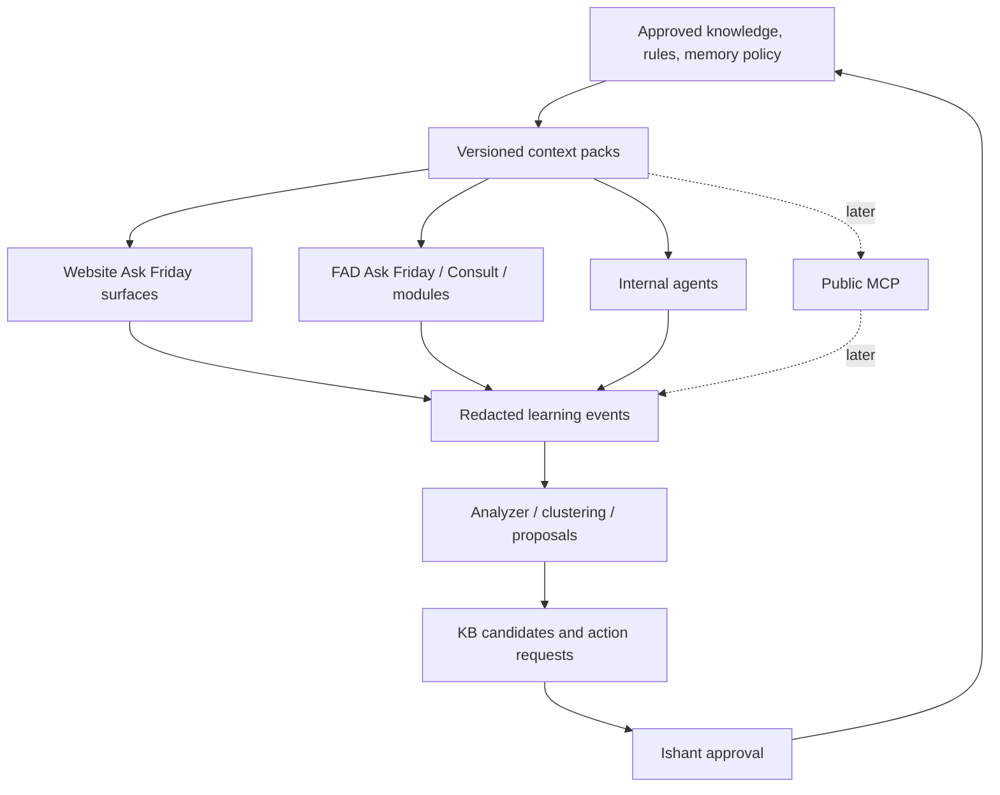

# FAD Essential Systems - Claude Code Handover - 2026-05-23

## Purpose

This handover is for Claude Code to continue Friday Admin Dashboard essential systems work after PR #4 was merged and deployed.

The previous Codex sessions have completed the first integrated slice:

- FAD live-data truth gates
- Ask Friday frontend polish
- Ask Friday Core v1 backend/docs scaffold
- production merge and deploy to `admin.friday.mu`

This document records exactly what shipped, what was verified, what remains, and how to restart safely.

It is intentionally long. Ishant is planning to merge the Ask Friday Core session and the FAD master/essential-systems session into one Claude Code continuation. Treat this as the bridge document for that merge.

## How To Use This Handover

Read this file before touching code.

Expanded handover path in a fresh repo/worktree:

- `docs/handover/2026-05-23-fad-essential-systems-claude-code-handover.md`

If Claude Code starts in a fresh worktree from `origin/fad-rebuild`, make sure it fetches the latest branch first so it sees this expanded docs-only handover.

This handover has four jobs:

1. Preserve current truth: what is live, which branch/commit is canonical, and which old branches should not be merged.
2. Preserve intent: what Ask Friday is meant to become across Website, FAD, owner/staff surfaces, public MCP, and internal agents.
3. Preserve guardrails: privacy, approval, naming, repo/session boundaries, and no self-updating production truth.
4. Give Claude Code a safe next work order that can continue without re-opening old coordination loops.

If this document conflicts with the live remote branch, trust the live remote branch and update this handover before proceeding.

## Big Picture: What We Are Building

Ask Friday is the user-facing intelligence layer across Friday.

It should eventually appear as one coherent assistant to guests, owners, staff, Ishant, and internal agents, while internally routing to scoped specialist capabilities. The user-facing surface stays simple: Ask Friday. Under the hood, each surface should receive only the context, memory, tools, and action permissions it is allowed to have.

The architecture direction is:

- A central FAD-owned Ask Friday Core stores runtime learning events, review queues, action requests, evals, identity/consent records, and approved context snapshots.
- Website Ask Friday surfaces remain lightweight guest/owner/public UX surfaces. They should emit compact redacted learning events and consume approved context packs.
- FAD Consult and future FAD modules can be more agentic because they are staff-authenticated, operational, and approval-aware.
- Internal agents can exchange sanitized summaries and requests with Core, but should not push unreviewed facts into canonical knowledge.
- Public MCP is a future integration target. It may eventually expose read tools and request-action tools, but not unsafe direct write/payment/booking execution in V1.
- Human approval, initially Ishant, is required before learned information becomes canonical.

The mental model is "truth down, evidence up":



Do not collapse this into direct self-learning. The AI may propose; the system may queue; Ishant approves; approved snapshots flow back down.

## Non-Negotiable Guardrails

- User-facing global AI surface is **Ask Friday**.
- Do not introduce alternate public product names in UI, docs, public copy, or handovers.
- No direct self-updating production truth.
- No raw secrets in learning events, public KBs, context packs, logs, prompts, or screenshots.
- No payment data in public KBs or learning events.
- No owner-private data in public KBs.
- No guest-sensitive data in public KBs.
- No private staff workload or internal staffing details in public KBs.
- Human approval is required before any learning becomes canonical.
- Anonymous public memory is session-only unless there is explicit consent.
- Durable cross-surface personalization is allowed only when authenticated, stay-token scoped, staff scoped, or explicitly consented.
- High-risk actions must be approval-routed.
- Do not edit Friday Website and FAD in the same checkout/session.
- Do not deploy without explicit coordination.

## Architecture Position As Of This Handover

The current implementation is not the finished Ask Friday system. It is the deployed backend scaffold and first essential-systems integration slice.

Already live:

- FAD-hosted Ask Friday Core schema.
- Core route mount under `/api/ask-friday/core`.
- Contract normalizers.
- Manual analyzer.
- Context-pack publisher.
- Deterministic eval runner.
- Initial seeded surface registry.
- FAD Ask Friday composer polish.
- FAD live-data truth gates.
- Gemini/Kimi model routing update.

Not yet fully live/operational:

- Review queue UI for KB candidates.
- Staff workflow for approving/rejecting candidates.
- First published production context packs.
- Scheduled/background analyzer job.
- Website event emitters.
- Website context-pack consumption.
- FAD frontend reading Core as the policy/context source of truth.
- Model-backed eval grading.
- Public MCP implementation.
- Retention/redaction worker for evidence refs.

The safest next work is therefore operationalization, not a redesign.

## Current Canonical State

- Repo: `/Users/judith/repos/friday-admin-dashboard`
- Canonical branch: `origin/fad-rebuild`
- Merged PR: `https://github.com/Friday-mu/friday-mu/pull/4`
- Merge commit on `fad-rebuild`: `1fec8633a36ea1c282441924e0c63c5da1fa0371`
- Integrated branch that fed PR #4: `codex/fad-essential-systems-20260523-62c1542`
- Integrated worktree used by Codex: `/Users/judith/.codex/worktrees/fad-essential-systems-20260523-62c1542`
- PR #4 merged at: `2026-05-23T07:00:50Z`
- Production deploy completed after merge.
- This handover itself was pushed after deploy as a docs-only follow-up. If `origin/fad-rebuild` is newer than `1fec8633a36ea1c282441924e0c63c5da1fa0371` only by handover/docs commits, live production is still expected to report `1fec863` until the next coordinated deploy. Do not deploy solely to update handover docs.

Live deployment evidence after deploy:

```json
{
  "frontend": {
    "url": "https://admin.friday.mu/version.json",
    "version": "1fec863",
    "branch": "fad-rebuild",
    "commit": "1fec8633a36ea1c282441924e0c63c5da1fa0371",
    "deployedAt": "2026-05-23T07:03:04Z"
  },
  "backend": {
    "url": "https://admin.friday.mu/api/version",
    "service": "fad-backend",
    "version": "1fec863",
    "commit": "1fec8633a36ea1c282441924e0c63c5da1fa0371",
    "built_at": "2026-05-23T07:04:06Z"
  }
}
```

Production roots:

- Frontend root: `/var/www/fad`
- Backend root: `/var/www/fad-backend`
- Backend PM2 process: `fad-backend`
- Working SSH identity used by Codex: `~/.ssh/do_friday_admin`

Backups taken before deploy:

- `/var/backups/fad-frontend-1fec863-20260523-070322`
- `/var/backups/fad-backend-1fec863-20260523-070322`

## Worktree And Branch Map

Use a fresh worktree from `origin/fad-rebuild` for new work. Do not keep building on old parked branches.

Canonical live branch:

- `origin/fad-rebuild`
- Live merge commit: `1fec8633a36ea1c282441924e0c63c5da1fa0371`

Current handover worktree:

- `/Users/judith/.codex/worktrees/fad-essential-systems-20260523-62c1542`
- Current local branch while writing this handover: `codex/fad-claude-code-handover-20260523`
- This branch is for documentation/handover only unless Ishant explicitly says otherwise.

Parked/superseded branches:

- `codex/ask-friday-core-v1-20260523`
  - Core work was cherry-picked into PR #4.
  - Do not PR it separately.
- `codex/fad-ask-friday-fab-polish-20260523`
  - FAB polish was superseded by integrated commit `88aa78f`.
  - Do not merge or PR it independently.
- `codex/fad-no-demo-data-20260523`
  - Use as a reference only for demo/live-truth cleanup.
  - Do not merge wholesale.

If Claude Code is asked to continue both FAD master and Ask Friday Core, the correct base is still a fresh worktree from latest `origin/fad-rebuild`, not any parked session branch.

## Coordination Status

The Ask Friday Core branch is parked:

- Branch: `codex/ask-friday-core-v1-20260523`
- Worktree: `/Users/judith/.codex/worktrees/ask-friday-core-v1-20260523`

Its backend/docs commits were integrated into PR #4:

- Original `d5e9deb` became integrated commit `e9cad94`
- Original `a8d85ee` became integrated commit `81f5ce6`
- Original `a98f84c` became integrated commit `aaf3bd7`

The old Ask Friday FAB polish branch is superseded:

- Branch: `codex/fad-ask-friday-fab-polish-20260523`
- Commit `15a3560` has the same stable patch-id as integrated commit `88aa78f`
- Do not merge or PR that branch independently.

Other related branches:

- `codex/fad-no-demo-data-20260523`: partially superseded by the live-data truth gate work in PR #4. If continuing demo cleanup, inspect it as reference only and do not merge wholesale.
- `codex/fad-notification-email-backoff-20260523`: already part of the pre-PR #4 base lineage through `fad-rebuild`.

The other Ask Friday/Core session can continue, but it should start from latest `origin/fad-rebuild` and create a fresh branch/worktree for any new work. Do not continue by pushing parked branches.

## Required Reading Map

Read local repo docs first:

- `docs/handover/2026-05-23-fad-essential-systems-claude-code-handover.md`
  - This file. Current operational truth and next work order.
- `docs/handover/2026-05-23-ask-friday-core-v1.md`
  - Original Core backend scaffold handover.
- `docs/architecture/ask-friday-core-v1-2026-05-23.md`
  - Architecture recommendation, V1 contracts, eval plan, implementation split.
- `docs/handover/2026-05-23-fad-convergence-pending-tasks.md`
  - Earlier convergence notes around FAD Ask Friday/FAB work.
- `frontend/DEMO_CRUFT.md`
  - Current live-data/demo-data cleanup inventory.

If Website integration enters scope, use a separate Friday Website session and read:

- `/Users/judith/Friday Website/docs/ASK-FRIDAY-UNIFIED-AI-LEARNING-LOOP-2026-05-23.md`
- `/Users/judith/Friday Website/docs/FAD-PROMPT-WEBSITE-AI-HANDOFF-2026-05-22.md`
- `/Users/judith/Friday Website/docs/ASK-FRIDAY-CONTEXT-ROUTER-2026-05-22.md`
- `/Users/judith/Friday Website/docs/ASK-FRIDAY-LIVE-QA-2026-05-22.md`
- If public MCP is in scope: `/Users/judith/Friday Website/docs/MCP-WEBSITE-SCOPE-2026-05-22.md`

Fetch Notion only when needed for architecture/API/module scope, not as a broad dump. Relevant Notion pages from the original scope:

- `Ask Friday Unified AI Learning Loop - Scope 2026-05-23`
- `Friday System Atlas`
- `FAD Architecture & Integrations`
- `Friday Knowledge Base - Batch 1 Product AI Ops`
- `Ask Friday Product Register`

Treat Notion as strategic/reference canon. Runtime truth for this deployed slice is the Git branch, migration, deployed backend, and live version endpoints.

## Naming Guardrails

- User-facing global AI surface: **Ask Friday**
- Do not introduce alternate public product names in UI, docs, handovers, public copy, or product wording.
- Internal specialist modes should use role names, for example `Design Agent`, `Finance Agent`, `Syndic Agent`.
- Owner Ask Friday remains owner-scoped.
- High-risk Ask Friday actions remain approval-routed.

## Website Handoff Contracts To Preserve

These are still active constraints for future work:

- `human_takeover` or `aiMayReply:false` stops website AI replies.
- Visitor follow-ups after takeover go to the FAD visitor-message proxy, not `/api/ask-friday`.
- Staff messages from FAD render as team replies.
- Public presence is public-safe only.
- Owner Ask Friday remains owner-scoped.
- High-risk Ask Friday actions remain approval-routed.

Do not touch the Friday Website repo until there is an explicit website-side task. If website changes are needed, use a separate fresh worktree in the Friday Website repo and coordinate the API contract first.

## Core Contracts To Respect

The architecture note has fuller JSON examples. This is the practical short version for implementers.

### `surface_registry`

Defines each Ask Friday surface and its allowed audience, knowledge scopes, tools, action types, memory policy, handoff policy, model policy, eval suites, and status.

Seeded/planned surface IDs include:

- `website_guest_hero`
- `website_ask_friday_fab`
- `website_owner_enquiry`
- `website_feedback_bug`
- `website_feedback_feature`
- `fad_consult`
- `fad_ops_assistant`
- `fad_finance_assistant`
- `public_mcp`
- `internal_agent_bridge`

Do not let one surface read another surface's private context by default.

### `learning_event`

Compact redacted event emitted by Website/FAD/internal agents after useful interactions.

It should contain summaries, source/surface IDs, identity reference, locale, intent, tools used, knowledge used, confidence, outcome, handoff state, privacy class, redaction status, and optional evidence refs.

It should not contain raw secrets, payment data, full private transcripts, owner-private content, guest-sensitive content, or private staff workload.

### `kb_candidate`

Proposal for a canonical knowledge/rule/memory update.

It must include candidate type, target layer, proposed change, source event IDs, evidence summary, risk class, trust tier, and review status.

Valid review states: `pending`, `approved`, `rejected`, `expired`, `needs_info`.

Ishant is the V1 reviewer.

### `context_pack`

Approved versioned snapshot consumed by a surface.

Only `published` context packs should be readable by API clients. Drafts and approvals stay staff-only.

### `action_request`

Approval-routed action proposal.

V1 should store and route action requests. It should not silently execute high-risk booking, payment, owner, staff, or operational writes.

### `identity_link` and consent

Use only for authenticated/stay-token/staff/explicit-consent memory.

Anonymous public visitors remain session-only unless explicit consent is captured.

## What Shipped In PR #4

### 1. Ask Friday FAB/frontend polish

Integrated from the superseded FAB polish branch:

- Reworked the global Ask Friday composer.
- Added server-side dictation support by reusing the existing `useDictation` hook.
- Added Stop while generating.
- Added request-id stale-response protection through `AbortController`.
- Preserved stopped turns in the visible transcript.
- Added one-message queueing while Ask Friday is thinking.
- Changed send behavior: Return inserts newline, Command/Ctrl+Enter sends, explicit Send button sends.
- Added explicit tool-step loading states.
- Improved action card styling and mobile stacking.
- Added direct execution when the operator sends a clear confirmation and there is exactly one pending executable action.
- Direct confirmation applies only to safe or approval-routed non-navigation actions.
- High-risk changes still route through approval-request actions.

Touched files include:

- `frontend/src/app/fad/_components/FridayDrawer.tsx`
- `frontend/src/app/fad/_components/FridayFullscreen.tsx`
- `frontend/src/app/fad/_data/fridayClient.ts`
- `frontend/src/app/fad/fad.css`
- `frontend/src/app/fad/_components/icons.tsx`

### 2. Live-data truth gates

The goal was to stop FAD from presenting fixture/demo counts as live operational truth.

Changes shipped:

- Finance sidebar fake count removed.
- Notification module/sidebar count is real-only.
- Fixture-derived pending counts suppressed in live-only contexts.
- Ask Friday context excludes demo/fixture module data.
- Ask Friday context includes live source metadata so responses can distinguish live data from unavailable data.
- Calendar fetch now uses an overlap-window reservation query instead of a narrow same-day query.
- Calendar clears stale rows while refetching.
- Notifications panel has real-only empty state behavior.
- Notifications module exposes push opt-in without fake notification count inflation.
- Update banner now polls `/version.json` every 5 minutes while the app stays open.
- `frontend/DEMO_CRUFT.md` updated with the current cleanup status.

Key touched files:

- `backend/src/fad/friday.js`
- `backend/src/fad/friday.test.js`
- `frontend/src/app/fad/_components/UpdateBanner.tsx`
- `frontend/src/app/fad/_components/modules/CalendarModule.tsx`
- `frontend/src/app/fad/_components/modules/NotificationsModule.tsx`
- `frontend/src/app/fad/_data/pendingCounts.ts`
- `frontend/src/app/fad/_data/reservationsClient.ts`
- `frontend/DEMO_CRUFT.md`

### 3. Ask Friday model routing

Changes shipped:

- Gemini provider added to `backend/src/ai/chat_proxy.js`.
- Ask Friday model preference now uses Gemini 3.5 Flash as primary where applicable.
- Kimi remains fallback.
- Fallback behavior is tested, including Gemini quota/rate-limit fallback to Kimi.

Key touched files:

- `backend/src/ai/chat_proxy.js`
- `backend/src/ai/chat_proxy.test.js`

### 4. Ask Friday Core v1 backend/docs

Integrated Core backend/docs from the parked Core branch.

New migration:

- `backend/migrations/074_ask_friday_core.sql`

New backend modules:

- `backend/src/ask_friday/contracts.js`
- `backend/src/ask_friday/analyzer.js`
- `backend/src/ask_friday/publisher.js`
- `backend/src/ask_friday/eval_runner.js`
- `backend/src/ask_friday/index.js`
- matching focused tests for each module

Server mount:

- `backend/server.js` mounts Core routes at `/api/ask-friday/core`

New docs:

- `docs/architecture/ask-friday-core-v1-2026-05-23.md`
- `docs/handover/2026-05-23-ask-friday-core-v1.md`
- `docs/handover/2026-05-23-fad-convergence-pending-tasks.md`

Core concepts now present:

- surface registry
- context packs
- learning events
- evidence references
- KB candidates
- approval-routed action requests
- eval cases
- eval runs
- identity links and consent events

Production database evidence:

```json
{
  "migration": {
    "filename": "074_ask_friday_core.sql",
    "applied_at": "2026-05-23T07:04:10.403Z"
  },
  "surfaces": 10,
  "contextPacks": 0
}
```

Authenticated smoke against `http://127.0.0.1:3002/api/ask-friday/core/surfaces` returned:

```json
{
  "surfaces": 8,
  "first": "internal_agent_bridge",
  "hasFadConsult": true
}
```

The difference between `surfaces: 10` in DB and `surfaces: 8` in the authenticated route is expected because the route defaults to `status=active`; two seeded surfaces are planned.

Unauthenticated route behavior:

- `GET https://admin.friday.mu/api/ask-friday/core/surfaces` returns `401 Unauthorized`
- This is expected.

## Verification Already Run

Before PR #4:

```bash
cd backend
npm test -- ask_friday
npm run build
npm test -- --runTestsByPath src/fad/friday.test.js src/ai/chat_proxy.test.js src/reservations/scheduleOverlap.test.js src/realtime/index.test.js --runInBand

cd ../frontend
npx tsc --noEmit
npm run build
```

Results:

- Ask Friday Core tests: 5 suites, 23 tests passed.
- Focused backend tests: 4 suites, 34 tests passed.
- Backend `npm run build`: passed.
- Frontend `npx tsc --noEmit`: passed.
- Frontend production build: passed.
- Naming scan for prohibited alternate public AI names: passed after doc cleanup.

After deploy:

- `https://admin.friday.mu/version.json` reports merge commit `1fec863`.
- `https://admin.friday.mu/api/version` reports merge commit `1fec863`.
- PM2 `fad-backend` online.
- Migration `074_ask_friday_core.sql` applied.
- Guesty poller initial sync after restart completed:
  - 60 listings
  - 200 reservations
- Live static chunk list matched the local `frontend/out/_next/static/chunks` list.
- Desktop and mobile browser smoke opened live sign-in successfully.

Browser smoke notes:

- Desktop screenshot: `/Users/judith/.codex/worktrees/bd21/friday-admin-dashboard/fad-live-desktop-1fec863.png`
- Mobile screenshot: `/Users/judith/.codex/worktrees/bd21/friday-admin-dashboard/fad-live-mobile-1fec863.png`
- Pre-login console showed 401s for tenant/design probes:
  - `/api/tenants/me/modules`
  - `/api/design/annex_a`
  - `/api/tenants/me`
- Those 401s are expected before authentication.

## Deployment Details

Frontend deploy:

- Built static export from `frontend/out`.
- Wrote `frontend/out/version.json` with merge commit metadata.
- Rsynced to `/var/www/fad`.

Backend deploy:

- Rsynced `backend/` to `/var/www/fad-backend`.
- Preserved production `.env`, caches, uploads, `node_modules`, and generated output boundaries.
- Ran remote syntax checks:
  - `node --check server.js`
  - `node --check src/ask_friday/*.js`
  - `node --check src/ai/chat_proxy.js`
  - `node --check src/fad/friday.js`
- Restarted PM2:

```bash
GIT_COMMIT=1fec8633a36ea1c282441924e0c63c5da1fa0371 \
APP_VERSION=1fec863 \
BUILD_TIME=2026-05-23T07:04:06Z \
pm2 restart fad-backend --update-env
```

Important deploy rule:

- If backend changes, do not deploy frontend-only.
- Frontend and backend should be deployed from the same SHA.

## Known Live Issues Or Residual Risk

These are not blockers for the merged/deployed slice, but Claude Code should know them:

1. Full authenticated product smoke was not completed.
   - Live sign-in screen was verified on desktop and mobile.
   - A real staff login is needed to test the in-app Ask Friday drawer, Calendar, Notifications, Finance sidebar, and UpdateBanner behavior end to end.

2. Context packs are not seeded/published yet.
   - DB shows `ask_friday_context_packs` count is `0`.
   - Core schema and publisher exist, but the first production context pack still needs to be created/published.

3. Ask Friday Core is deployed but not fully operationalized.
   - The route surface exists.
   - The FAD frontend is not yet fully wired to consume Core context packs/action registry as the source of policy truth.
   - Website-side event ingestion and context consumption still require a separate coordinated website slice.

4. Existing backend logs still include older issues unrelated to PR #4:
   - Kimi timeouts and context length failures in older inbox/consult flows.
   - Some older realtime email 429 entries before the backoff work.
   - Older analytics batch upstream 401s.
   - These were present before this deploy and should be triaged separately unless they reproduce after `1fec863`.

5. Deploy docs contain stale references.
   - Some files still reference `/var/www/friday-dashboard` or Docker deploy scripts.
   - Recent operational truth is `/var/www/fad` and `/var/www/fad-backend`.
   - Clean up deploy docs in a docs-only slice.

6. Disk usage on VPS was 86 percent before deploy.
   - After backups there was still about 3.5G free.
   - Do not create repeated full backups without checking disk.

## What Claude Code Should Do Next

### Immediate next step: post-deploy stabilization

Run this first before new feature work:

```bash
curl -fsS https://admin.friday.mu/version.json
curl -fsS https://admin.friday.mu/api/version
ssh -i ~/.ssh/do_friday_admin -o BatchMode=yes -o IdentitiesOnly=yes root@admin.friday.mu \
  'pm2 describe fad-backend | sed -n "1,80p"; pm2 logs fad-backend --lines 100 --nostream'
```

Check:

- no new migration failures
- no crash loop
- Guesty poller still healthy
- no new 5xxs from touched routes
- `/api/ask-friday/core/surfaces` still works with an authenticated staff token

Then do authenticated browser smoke with a real staff login:

- sign in
- open Ask Friday drawer
- open Ask Friday fullscreen
- send a harmless Ask Friday question
- verify Stop and queued send behavior if safe
- open Calendar and confirm live reservations load
- open Notifications and confirm no fake count
- confirm Finance sidebar has no fake count
- leave tab open long enough to make sure UpdateBanner does not false-positive
- mobile viewport smoke for sign-in and Ask Friday entrypoint

### Next implementation slice: Ask Friday Core operationalization

Recommended first slice:

1. Seed and publish the first context pack.
2. Add a small admin/dev command to publish or inspect context packs.
3. Wire FAD Ask Friday to read the relevant Core context/action registry where appropriate.
4. Keep high-risk actions approval-routed.
5. Add tests around context-pack retrieval and frontend client behavior.

Expected useful files:

- `backend/src/ask_friday/publisher.js`
- `backend/src/ask_friday/index.js`
- `backend/src/ask_friday/contracts.js`
- `backend/migrations/074_ask_friday_core.sql`
- `frontend/src/app/fad/_data/fridayClient.ts`
- `frontend/src/app/fad/_components/FridayDrawer.tsx`
- `frontend/src/app/fad/_components/FridayFullscreen.tsx`

Before editing frontend Ask Friday files, verify no other active session owns them.

### Next implementation slice: data truth cleanup

Continue from `frontend/DEMO_CRUFT.md`.

Priorities:

- audit remaining sidebar counts
- audit fixture-backed module cards
- remove or label demo-only financial, legal, owner, marketing, and analytics data
- ensure Ask Friday context never ingests fixture/demo module data as truth
- add tests for any backend truth endpoint touched

Reference branch:

- `codex/fad-no-demo-data-20260523`

Use it as reference only; do not merge it wholesale.

### Next implementation slice: Notifications and realtime follow-up

After authenticated smoke:

- confirm Push opt-in flow works
- confirm VAPID public/private env state in prod if push is expected
- check email-notification backoff behavior in current logs
- do not add fake notification data

### Next implementation slice: deploy docs cleanup

Docs still conflict.

Clean targets:

- `docs/deploy.md`
- `CLAUDE.md`
- old script references if still misleading

Canonical live facts:

- frontend root `/var/www/fad`
- backend root `/var/www/fad-backend`
- PM2 process `fad-backend`
- `admin.friday.mu` is canonical

Do not run old Docker deploy scripts unless explicitly revalidated.

## Fresh Claude Code Start Prompt

Paste this into Claude Code:

```text
You are continuing the merged Friday Admin Dashboard essential systems + Ask Friday Core work.

Repo:
/Users/judith/repos/friday-admin-dashboard

Canonical branch:
origin/fad-rebuild

Latest deployed merge commit:
1fec8633a36ea1c282441924e0c63c5da1fa0371

First, do not implement until grounded:
1. Read CLAUDE.md and any AGENTS.md if present.
2. git fetch origin --prune
3. git ls-remote origin refs/heads/fad-rebuild
4. Create a fresh worktree from latest origin/fad-rebuild.
5. Verify the worktree descends from current remote tip.
6. Read `docs/handover/2026-05-23-fad-essential-systems-claude-code-handover.md`.
7. Check live frontend truth at https://admin.friday.mu/version.json.
8. Check backend truth at https://admin.friday.mu/api/version.
9. Do not deploy unless explicitly coordinating a deploy.

Current live evidence should be:
- Frontend version 1fec863, commit 1fec8633a36ea1c282441924e0c63c5da1fa0371
- Backend version 1fec863, commit 1fec8633a36ea1c282441924e0c63c5da1fa0371
- PM2 process fad-backend online
- Ask Friday Core migration 074_ask_friday_core.sql applied
- origin/fad-rebuild may be newer by docs-only handover commits. Treat that as expected branch/live skew unless code changed after 1fec863.

Coordination:
- PR #4 is merged and deployed.
- Ask Friday Core parked branch is codex/ask-friday-core-v1-20260523. Its work is already integrated. Do not merge or PR it independently.
- Old Ask Friday FAB polish branch is superseded. Do not merge or PR it independently.
- Use a fresh branch/worktree for new work.

Guardrails:
- User-facing global AI surface is Ask Friday.
- Do not introduce alternate public product names in UI/docs/public wording.
- Internal specialist modes should use role names.
- Website handoff contracts must be preserved:
  - human_takeover or aiMayReply:false stops website AI replies
  - visitor follow-ups after takeover go to FAD visitor-message proxy, not /api/ask-friday
  - staff messages from FAD render as team replies
  - public presence is public-safe only
  - owner Ask Friday remains owner-scoped
  - high-risk Ask Friday actions remain approval-routed

Recommended next order:
1. Post-deploy log watch and authenticated smoke on live FAD.
2. Ask Friday Core operationalization:
   - seed/publish first context pack
   - wire FAD Ask Friday to Core context/action registry where appropriate
   - add approval/admin surface for Core action requests and KB candidates
   - add eval runner command/admin path
3. Continue data truth cleanup from frontend/DEMO_CRUFT.md.
4. Clean stale deploy docs after product smoke.

Verification before saying fixed:
- focused backend tests for touched paths
- backend npm run build if backend changed
- frontend npx tsc --noEmit if frontend changed
- frontend npm run build if frontend changed
- desktop and mobile browser smoke
- live route checks if deployed
- no frontend-only deploy if backend changed
```

## Useful Commands

Create a fresh worktree:

```bash
cd /Users/judith/repos/friday-admin-dashboard
git fetch origin --prune
git ls-remote origin refs/heads/fad-rebuild
git worktree add -b codex/fad-next-slice-YYYYMMDD /Users/judith/.codex/worktrees/fad-next-slice-YYYYMMDD origin/fad-rebuild
cd /Users/judith/.codex/worktrees/fad-next-slice-YYYYMMDD
git merge-base --is-ancestor origin/fad-rebuild HEAD && echo ok
```

Post-deploy checks:

```bash
curl -fsS https://admin.friday.mu/version.json
curl -fsS https://admin.friday.mu/api/version
curl -i -sS https://admin.friday.mu/api/ask-friday/core/surfaces | sed -n '1,20p'
```

Expected unauthenticated Core route result:

- `401 Unauthorized`

Generate a short-lived staff smoke token on the VPS for local loopback testing only:

```bash
ssh -i ~/.ssh/do_friday_admin -o BatchMode=yes -o IdentitiesOnly=yes root@admin.friday.mu 'cd /var/www/fad-backend; node - <<'"'"'NODE'"'"'
require("dotenv").config();
const jwt = require("jsonwebtoken");
const token = jwt.sign({
  user_id: "deploy-smoke",
  role: "admin",
  username: "deploy-smoke",
  display_name: "Deploy Smoke",
  tenant_id: "00000000-0000-0000-0000-000000000001"
}, process.env.JWT_SECRET, { expiresIn: "5m" });
process.stdout.write(token);
NODE'
```

Backend verification:

```bash
cd backend
npm test -- ask_friday --runInBand
npm test -- --runTestsByPath src/fad/friday.test.js src/ai/chat_proxy.test.js src/reservations/scheduleOverlap.test.js src/realtime/index.test.js --runInBand
npm run build
```

Frontend verification:

```bash
cd frontend
npx tsc --noEmit
npm run build
```

Deploy reminder:

- Coordinate before deploy.
- Build frontend.
- Stamp `frontend/out/version.json` with the target deployed SHA.
- Backup `/var/www/fad` and `/var/www/fad-backend`.
- Rsync frontend to `/var/www/fad`.
- Rsync backend preserving `.env`, caches, uploads, `node_modules`, and generated output.
- Restart PM2 with `GIT_COMMIT`, `APP_VERSION`, and `BUILD_TIME`.
- Verify live frontend/backend versions and touched routes.

## Rollback Notes

Preferred rollback:

1. `git revert` the bad commit on `fad-rebuild`.
2. Redeploy frontend and backend from the reverted SHA.

Emergency artifact rollback:

- Restore frontend from `/var/backups/fad-frontend-1fec863-20260523-070322`.
- Restore backend from `/var/backups/fad-backend-1fec863-20260523-070322`.
- Restart PM2 `fad-backend`.
- Confirm `/version.json`, `/api/version`, and touched flows.

Only use artifact rollback if the live system is actively broken and a clean git revert/deploy is too slow.

## Current Assessment Before Next Work

The integrated slice is shipped and live. The platform is ready for parallel continuation if every session starts from latest `origin/fad-rebuild` and avoids the parked/superseded branches.

The best next move is not more broad merging. It is a focused post-deploy smoke, then a narrow Ask Friday Core operationalization slice, followed by data-truth cleanup.

## Recommended Combined Claude Code Work Order

If Ishant gives Claude Code both this handover and the FAD master session handover, continue in this order.

### Slice 0: Grounding and branch setup

Goal: create a clean continuation point and avoid duplicate merges.

1. `git fetch origin --prune`.
2. Confirm `origin/fad-rebuild` points at or descends from `1fec8633a36ea1c282441924e0c63c5da1fa0371`.
3. Create a fresh worktree from `origin/fad-rebuild`.
4. Read this handover, the Core architecture note, and `frontend/DEMO_CRUFT.md`.
5. Confirm old Core/FAB branches are not being merged independently.

Stop only if the remote branch has moved in a way that does not contain `1fec863`.

### Slice 1: Post-deploy smoke and log check

Goal: establish live baseline before changing anything.

Checks:

- live `/version.json`
- live `/api/version`
- PM2 status/logs
- migration table confirms `074_ask_friday_core.sql`
- unauthenticated Core routes return 401
- authenticated `/api/ask-friday/core/surfaces` returns active surfaces including `fad_consult`
- staff login smoke
- Ask Friday drawer/fullscreen smoke
- Calendar live reservations
- Notifications real-only state
- Finance no fake sidebar count
- mobile viewport smoke

If authenticated smoke cannot be completed, park that item explicitly and move to code work only if the live version/log checks are healthy.

### Slice 2: Ask Friday Core review queue

Goal: make the deployed Core scaffold usable by staff.

Preferred first implementation:

- staff route/API additions only where needed
- list/filter `ask_friday_kb_candidates`
- inspect evidence summary and source events
- approve/reject/needs-info flow
- clear reviewer/audit fields
- no auto-publish by default
- focused tests for candidate transitions

Frontend may be needed for a minimal admin view. Keep it narrow and consistent with FAD's dense operational UI. Avoid broad redesign of the FAB/composer.

### Slice 3: Context pack publishing flow

Goal: make approved knowledge flow down safely.

Preferred implementation:

- seed/create first draft context pack for `fad_consult`
- publish only via staff action
- record version, approved_by, approved_at
- expose published pack through existing Core API
- add tests for draft vs published visibility
- do not wire Website yet in this same FAD checkout

### Slice 4: Analyzer operationalization

Goal: move from manual analyzer to controlled operational workflow.

Preferred implementation:

- keep manual `/analyzer/run`
- add explicit staff-triggered dry-run and commit modes, or a scheduled worker with dry-run default
- cluster recent learning events into candidates
- never auto-approve
- add idempotency guard so repeated runs do not spam duplicate candidates
- add tests around duplicate suppression and privacy class handling

### Slice 5: FAD Ask Friday consumes Core cautiously

Goal: begin using Core as policy/context source without breaking the working composer.

Preferred implementation:

- retrieve relevant `fad_consult` context pack
- merge it into Ask Friday context building as a bounded supplement
- include source/version metadata
- preserve Gemini/Kimi fallback
- preserve Stop/queue/stale-response behavior
- preserve high-risk approval routing
- add tests around missing context pack fallback

### Slice 6: Website integration in separate session

Goal: make Website emit evidence up and consume approved truth down.

Must be separate from FAD worktree/session.

Website work should:

- emit compact redacted `learning_event` from guest hero, Ask Friday FAB, owner enquiry, feedback bug, feedback feature
- preserve `human_takeover` and `aiMayReply:false` behavior
- send visitor follow-ups after takeover to FAD visitor-message proxy
- consume only `published` context packs
- keep owner Ask Friday owner-scoped
- avoid public web search for owner Ask Friday unless separately approved

Do not do Website changes in the FAD checkout.

### Slice 7: Eval improvements

Goal: turn production-derived cases into regression protection.

Preferred implementation:

- keep deterministic runner
- add model-backed scoring later, behind explicit config
- score answer quality, handoff correctness, action safety, privacy safety, language match, low-confidence honesty
- record eval run metadata and model version
- no fine-tuning

### Slice 8: MCP design and later implementation

Goal: let external agents query/request Ask Friday capabilities without bypassing approval.

V1 posture:

- design first
- read tools can expose public-safe published context
- write tools should create `action_request`
- no direct payment/booking/private owner/staff writes
- no unapproved KB mutation
- no raw internal event stream

### Slice 9: Retention/redaction worker

Goal: make learning storage safer over time.

Preferred implementation:

- expire or compact old raw evidence refs
- retain summaries and approved candidates
- prove redaction status before candidate generation
- add admin visibility for privacy class and retention status

## Legacy Pending Tasks Not To Lose

These are older FAD convergence tasks that are not the first Ask Friday Core slice, but they should not disappear from the merged Claude Code context. Treat them as backlog/context unless Ishant explicitly chooses one as the active next slice.

### Ask Friday polish backlog

- Replace simulated tool-step progress with true tool-call telemetry.
- Add streaming responses only if backend partial-state handling is ready.
- Improve "continue from stopped turn" behavior after streaming/partial state exists.
- Add module-scoped internal agent modes under the Ask Friday surface.
- Run full live desktop/mobile Ask Friday smoke after any Ask Friday UI deploy.

### Calendar UX and data audit

- Investigate duplicate reservations.
- Fix bad or clipped date-line UI.
- Confirm real reservations and real tasks are wired.
- Confirm useful cross-links into Operations, Reservations, Properties, and Inbox.
- Recover prior Calendar work if current code regressed.

### Inbox and Friday Consult repair

- Re-check awaiting-reply behavior and placement.
- Restore/verify reservation side panel context: guest count, financial details, payment/status, reservation status, stay context.
- Investigate missed auto-drafts.
- Improve draft quality, stale-draft safety, and full-message-history grounding.
- Verify reservation/property/availability/KB/teachings/action-feedback context wiring.
- Preserve backend send truth and human approval.

### Website AI handoff into FAD

- Verify the live FAD contract after Website changes.
- Ensure handoff state includes messages and visitor follow-up URL where expected.
- Human takeover must prevent double replies.
- Product/permission audit the team-safe public presence endpoint.
- Website conversations should become live team chat in FAD when taken over, then optionally move to email until WhatsApp is configured.

### Operations backlog

- Screen-by-screen real-data audit: Overview, My Tasks, All Tasks, Schedule Planner, Reported Issues, History, Roster, Insights, Settings.
- Continue desktop UI simplification inside Ops-owned files.
- Run a mobile Ops pass.
- Build natural-language task creation on top of real `/api/tasks`.
- Functionally audit Schedule Planner.
- Recover Roster/Insights with real data only.
- Audit booking-triggered task automation.
- Run Field access and HR permissions regression.
- Clean up comment mention UI.

### Real-data module audits

- Reviews: confirm live API data and remove fake persisted/demo data.
- HR: confirm latest editable backend-wired version is present.
- Design: confirm recovered Design module and projects are present.
- Training: confirm teachings are real and editable where expected.
- Notifications: confirm no demo-backed notification data remains.

### Manage and multi-tenant recovery

- Recover or identify the previous Manage section.
- Audit recent Ask Friday, Inbox, Ops, Website handoff, Notifications, and module clients for tenant safety.
- Do not expose cross-tenant data in global context loaders.

### Friday Stay Portal coordination

- Read `/Users/judith/Friday Website/docs/FAD-STAY-TOKEN-API-CONTRACT-2026-05-21.md` before stay-token work.
- Confirm FAD backend contract and Inbox/Ops handoff paths.
- Inbox receives guest communication/support context only.
- Operations owns real tasks, support cases, access readiness, and issue closure.

### Mary QA staff task/message path

- Use a FAD-native staff task/message surface if it exists.
- Do not fake a guest conversation.
- If no staff task/message surface exists, implement the smallest safe path before sending the QA brief.

### WhatsApp burner bridge

- Prototype branch exists but is parked.
- Do not merge or deploy it until explicitly reactivated.
- Still blocked on burner QR/pairing and delivered-message verification.

### Repo bootstrap/deploy docs cleanup

- `CLAUDE.md` and some deploy docs still contain stale statements from older phases.
- Cross-check live truth before trusting older deploy paths or "no backend yet" language.
- Current production roots remain `/var/www/fad` and `/var/www/fad-backend`.
- Clean stale bootstrap/deploy docs in a docs-only slice, not during a feature deploy.

## Decision Log

Decisions already made in this combined session:

- Ask Friday is the user-facing global AI surface.
- FAD should own Ask Friday Core V1 runtime storage and review workflow.
- Website should emit compact redacted events and consume approved snapshots, not own durable learning.
- Human approval is required before learning becomes canonical.
- Cross-surface memory is strategically desirable, but only with authentication, stay-token scoping, staff scope, or explicit consent.
- Public MCP can be a future interface, but should route writes through request/approval mechanisms.
- FAD Consult can become more agentic than public Website surfaces because it is staff-authenticated and operational.
- Core and FAB polish were merged through PR #4; old branches are parked.

Open decisions or likely future calls:

- Exact first context pack content for `fad_consult`.
- Whether context packs are authored manually first or generated from approved KB candidates first.
- Review queue location in FAD navigation.
- Whether analyzer runs on schedule, staff trigger, or both.
- Exact retention windows by privacy class.
- Public MCP timing and allowed tool list.
- Website durable memory consent UX.

Where unsure, choose the safer path: draft, review, publish, then consume.

## Paste-Ready Merged Session Prompt

Use this if Ishant is creating one Claude Code session from both the FAD master context and Ask Friday Core context:

```text
You are Claude Code continuing the merged FAD master / essential systems / Ask Friday Core work.

Start from live truth, not old session branches.

Canonical repo:
/Users/judith/repos/friday-admin-dashboard

Canonical branch:
origin/fad-rebuild

Latest deployed merge commit:
1fec8633a36ea1c282441924e0c63c5da1fa0371

First actions:
1. Read AGENTS.md / CLAUDE.md.
2. git fetch origin --prune.
3. Create a fresh worktree from latest origin/fad-rebuild.
4. Read `docs/handover/2026-05-23-fad-essential-systems-claude-code-handover.md`.
5. Read docs/handover/2026-05-23-ask-friday-core-v1.md.
6. Read docs/architecture/ask-friday-core-v1-2026-05-23.md.
7. Verify live version endpoints:
   - https://admin.friday.mu/version.json
   - https://admin.friday.mu/api/version

Do not merge or PR these old branches independently:
- codex/ask-friday-core-v1-20260523
- codex/fad-ask-friday-fab-polish-20260523

Do not deploy unless Ishant explicitly asks and FAD coordination is clear.

Primary goal:
Continue from the deployed Ask Friday Core scaffold and FAD essential-systems slice. First do post-deploy smoke/log checks. Then implement the next narrow operationalization slice:
- review queue for KB candidates,
- context-pack publish flow,
- analyzer operationalization,
- or cautious FAD Ask Friday consumption of published Core context.

Guardrails:
- User-facing AI surface is Ask Friday.
- Do not introduce alternate public product names.
- No direct self-updating production truth.
- Human approval is required before learning becomes canonical.
- No raw secrets, payment data, owner-private data, guest-sensitive data, or private staff workload in public KB/context.
- Website changes require a separate Friday Website worktree/session.
- High-risk actions stay approval-routed.

Verification before done:
- focused backend tests for touched paths,
- backend build if backend changed,
- frontend typecheck/build if frontend changed,
- desktop/mobile browser smoke for UI changes,
- live checks only after a coordinated deploy.
```
